# PG3 グリッパ組み立てマニュアル

**10手順／グリッパ単体1台分／2026-10-03／実物確認前のドラフト**

低背型V2（爪+20 mm）のグリッパが対象です。カメラ、アーム、P05の取り付けは含めません。ID5のXL430-W250-T 1台で開閉します。対象CADのSHAは同梱の `review-checks.json` に記録しています。

**実物写真との版照合（10/3追記）：** 提供されたグリッパ写真は、細い接触板の旧C7が有力です。本書のV2とは爪・スライダ・パッドの形状が異なる可能性があります。写真の爪に本書の完成形状やパッド寸法をそのまま適用せず、爪板の前後長を照合してください（C7：12.1 mm、C9：28.0 mm、V2：48.0 mm、いずれも設計値）。C7からC9への改訂は爪2個とスライダ2個の交換です。照合概要は [実物写真との版照合](PHOTO_VERSION.md) に記録しました。

**現時点で実物組立を承認する手順書ではありません。** ケース固定ねじ、実ねじのかかり、締付トルク、印刷公差、ナットの保持方法が未確定です。工程2のケース固定は確認待ち。図はCADの取り付け位置を工程順に表示したもので、部品の挿入経路や実工具の操作を実証した写真ではありません。

**P05の配線窓（10/3改善）：** 保存V2の3×8 mmから、別候補では左右各5.5×10.2 mm・四隅R0.5 mmへ拡大しています。ねじ穴と実ケース座面は保持。直径1.9 mmの仮線に対するP05側の余裕は0.55→1.65 mmです。EHR-3公称筐体9.5×3.8 mmを縦向きに通す窓単体の検査は、モーター取り付け前の状態で最小0.35 mmの隙間があります。モーター装着後の直線コネクタアクセスは後カバーに当たるので合格ではありません。内部90度曲げ・後カバー側0.25 mmの仮経路、配線済みモーターの挿入・実ハーネス・印刷公差は未確認です。P05の内幅28.5 mmとケース公称幅の一致も組付け合格を意味しません。[P05改善候補の詳細](../../studies/p05-cable-20261003/README.md) を参照してください。本書のグリッパ部分は元V2と同形状です。

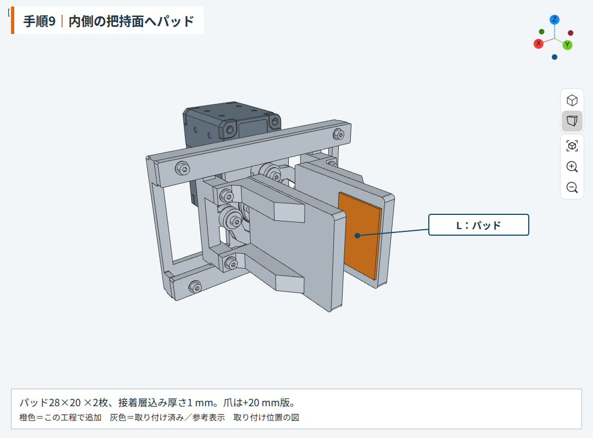

## 最初に用意するもの

### 図の読み方と呼び名

| 図・呼び名 | 意味 |
|---|---|
| 正面図 | 爪側から奥を見る。穴位置とねじ本数を確認 |
| 斜視図 | 奥行きを確認。奥側が隠れる場合は反対側図へ |
| 背面図 | モーター側から見る。ナットの受け位置を確認 |
| 橙色 | この工程で追加する部品。色だけでなく名前・B番号も確認 |
| ホーン | モーターの出力軸に付く円形の取付部品 |
| クランク | ホーンと一緒に回り、左右リンクを動かす中央部品 |
| スライダ／carriage | 枠の中を左右へ動き、爪を支える部品 |
| 印刷肩 | 支点にある段付きの突起。リンクの穴がここに掛かる |

組立の流れ：部品確認 → 枠の固定確認 → スペーサー・クランク → 裸のスライダ・ナット → リンク → 4支点抜け止め → 上下押さえ → 左右爪 → パッド → 点検。**爪と押さえを先に付けると、支点・ナットの作業がしにくくなるため、この順で計画します。**

### 印刷部品：9種類・11個

| 呼び名 | CAD名 | 数量 |
|---|---|---:|
| 本体枠 | PG3_frame | 1 |
| 上下押さえ | PG3_cap_U / PG3_cap_D | 各1、計2 |
| 左右スライダ | PG3_carriage_L / PG3_carriage_R | 各1、計2 |
| 左右の爪（V2、+20 mm） | PG3_finger_L / PG3_finger_R | 各1、計2 |
| クランク | PG3_crank | 1 |
| 左右リンク | PG3_link_L / PG3_link_R | 各1、計2 |
| ホーンスペーサー | PG3_horn_spacer | 1 |

爪は `studies/low-profile-20260926/outputs/low-profile-250g/CAD/PG3_finger_L.step` と右側の同名ファイルを参照します。旧C9の短い爪と混同しないでください。上記数量は設計の部品構成で、印刷条件や製作リリースを指定するものではありません。

### ねじ・ナット・座金：1台分

**ねじ表記の読み方：** M2×6は「ねじ径2 mm、長さ6 mm」です。六角穴付きボルトの長さは、頭の下面から先端までを測り、頭は含みません。各手順にも径・長さ・本数を明記しています。

| 記号 | 規格・寸法（mm） | 数量 | 使う手順・用途 |
|---|---|---:|---|
| B1 | M2×6 六角穴付き | 4 | 3：クランク→ホーン |
| B2 | M2×8 六角穴付き | 2 | 6：リンク→スライダ支点 |
| B3 | M2×10 六角穴付き | 2 | 6：リンク→クランク支点 |
| B4 | M2×12 六角穴付き | 4 | 7：上下押さえ |
| B5 | M2×16 六角穴付き | 4 | 8：左右の爪 |
| B6 | M2.6皿タッピング、CAD全長5（頭を含む） | 2 | 2：枠→ケース。**実物適合未確定** |
| N1 | M2ナット、二面幅4・厚さ1.6 | 12 | 支点4・押さえ4・爪4 |
| W1 | 通常座金、外径5・内径2.2・厚さ0.3 | 8 | 押さえ4・爪4 |
| W2 | 大径座金、外径7・内径2.2・厚さ0.5 | 4 | 支点4。W1への置換不可 |

**合計：ねじ18本（通常のM2ボルト16本＋ケース用候補2本）、M2ナット12個、座金12枚。** カメラ用M3、アーム用ねじ、モーター内部ねじは含みません。数量は表示中のV2 CADの部品名で再集計済み。実ねじの山・材質・品番はこの集計では確定していません。

M2六角穴のCAD寸法は1.5 mm。1.5 mm六角レンチを工具候補とし、実際のねじ頭に合うことを確認します。B6の頭に合う工具、ナット対向保持用工具、必要な締付トルクは未確定です。M2ボルトの長さは頭を含まない長さ、B6のモデル全長は皿頭を含む長さなので、測り方を混同しないでください。

その他：XL430-W250-Tと出力ホーンを1組、28×20×1 mmのパッドを2枚。パッドの1 mmは接着層込み。材料・接着剤は未選定です。CADの `PG3_XL430_fixed` が複数表示要素になっていても、物理モーターは1台です。

### 工程別の新規投入数（同じナットを二重に数えない）

| 手順 | 新しく投入するねじ | 新しく入れるN1 | 新しく入れる座金 |
|---|---|---:|---|
| 1 | なし | 0 | なし |
| 2 | B6候補×2。適合確認待ち | 0 | なし |
| 3 | B1×4 | 2（クランク支点用） | なし |
| 4 | なし | 6（スライダ支点2＋爪用4） | なし |
| 5 | なし | 0 | なし |
| 6 | B2×2＋B3×2 | 0（先に入れた4個を使用） | W2×4 |
| 7 | B4×4 | 4 | W1×4 |
| 8 | B5×4 | 0（先に入れた4個を使用） | W1×4 |
| 9・10 | なし | 0 | なし |
| 合計 | 18本、うちB6候補2本 | 12 | W1×8＋W2×4＝12 |

## 手順1／部品と向きを確認する

**使うねじ：なし。**

- 本体枠、押さえ2個、スライダ2個、爪2個、クランク、リンク2個、スペーサーを並べます。
- 左右の品名はCADのL/Rに合わせます。見ている方向で左右が変わるため、画像だけでL/Rを判断しません。
- 本書の正面図は爪側からモーターへ向かって見る図です。この視点では画面左がCADのR、画面右がCADのLです。斜視では奥行きも確認します。
- U/Dは部品名です。この固定版では `PG3_cap_U` が図の下、`PG3_cap_D` が図の上に配置されています。品名のUを画面の上と読み替えません。
- 爪の把持面を内側へ向けます。スライダの上下の延長シューは中央を向く配置です。
- 穴のつぶれ、摺動面の突起、割れを点検します。合わない穴をこのマニュアルの判断だけで拡大しません。

**確認：** V2の延長爪が左右1個ずつあり、ねじを長さ別に分けられていること。

## 手順2／本体枠とID5ケースの固定を確認する【確認待ち】

**使用候補：B6＝ねじ径2.6 mm、頭込みCAD全長5 mm、2本。本体枠×1、ID5モーター×1。ナット・座金なし。**

B6の長さ5 mmは皿頭を含むモデル全長です。実物に使うねじの規格・長さは確認待ちです。

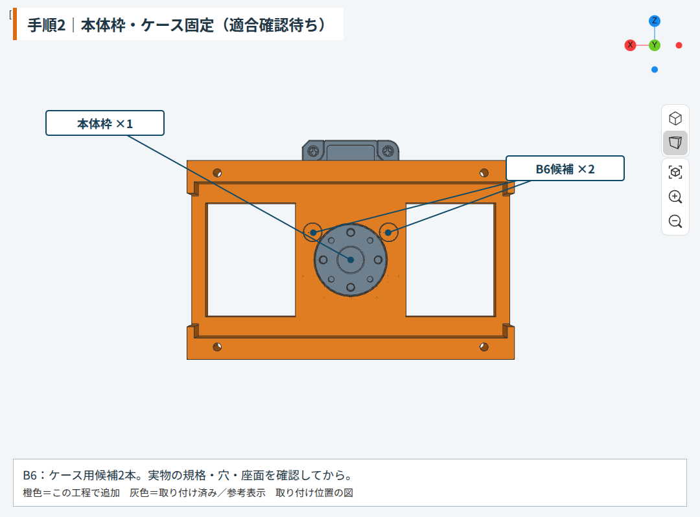

枠を出力ホーン側に配置する設計です。CADでは `PG3_case_tapper_-11` と `PG3_case_tapper_11` の2本を使います。ただし、このM2.6皿タッピング全長5のモデルを、そのまま購入品や実ケースの前ぶたねじに置き換えてよいとは確認できていません。

**ここは実物への取り付けを進める前の停止点です。** 相手がケースの下穴か、既存ケースねじの交換位置かを実物と図面で特定し、ねじ種類・頭の座り・有効深さ・底付き・ケース締結の維持を確認します。前ぶたの元ねじは別資料ではFHS M2.5×10であり、B6を同じねじと扱いません。未確認のねじをねじ込まないでください。

以降の図と手順は、この固定が成立した場合の組立計画です。ケース固定が完了した記録を意味しません。

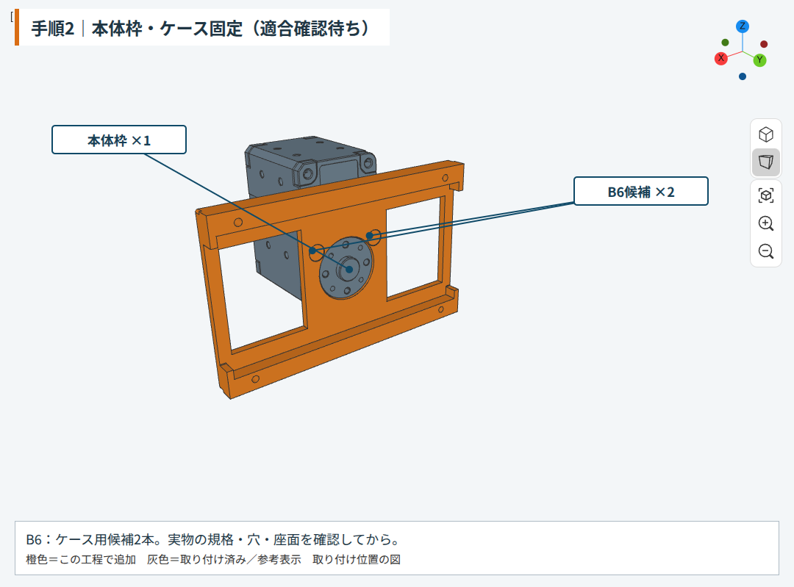

## 手順3／ホーンスペーサーとクランクを配置する

**使用：B1＝ねじ径2 mm（M2）、長さ6 mm、4本。クランク×1、スペーサー×1。支点用N1×2を先に用意。座金なし。**

ボルトの長さは6 mmです。頭の下面から先端までの長さで、頭は含みません。

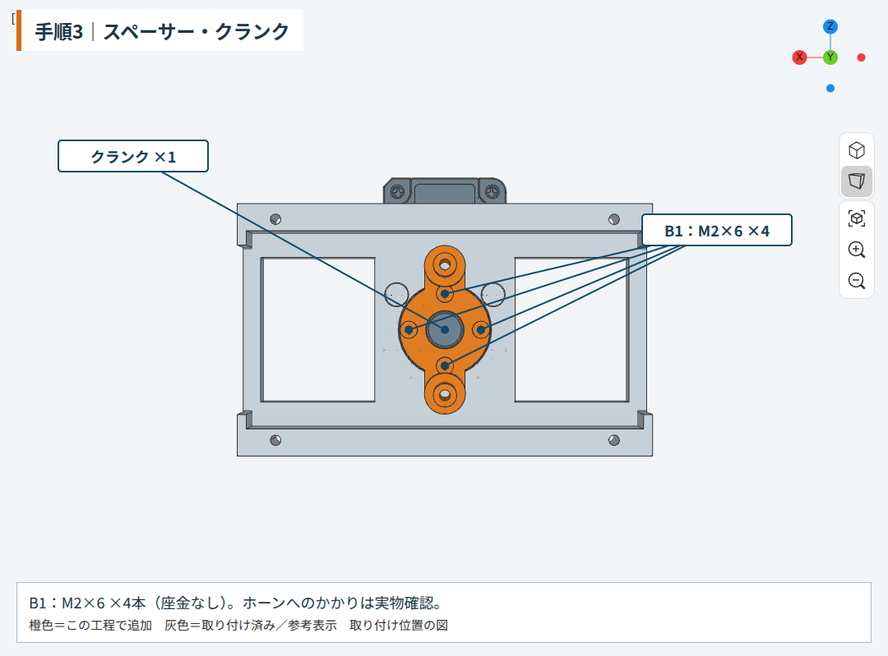

- クランク側の左右支点ナット2個は、背面へアクセスできる段階で受け位置に用意します。後で保持できなくなる配置を避けます。
- 出力ホーン→ホーンスペーサー→クランクの順に、4穴を合わせます。
- 図の手前から見た重なり順は「ねじ頭 → クランク → スペーサー → ホーン → モーター」です。スペーサーは正面図ではクランクの背後に隠れます。
- B1を4本、クランク側からホーン側へ通す設計です。穴の合わない位置へ無理に締め込みません。
- ホーンとクランクの相対位置を写真で残します。CADの中間姿勢をモーターの絶対角とみなさず、サーボ軸を無理に手回ししません。

**確認：** ホーンへのねじ込み深さと底付き、実ねじ山の適合、スペーサーの座りを実物で確認すること。メーカー資料を基にした既存台帳ではホーンの最大深さは3.5 mmですが、必要な最小かかりや締付トルクは未確定です。

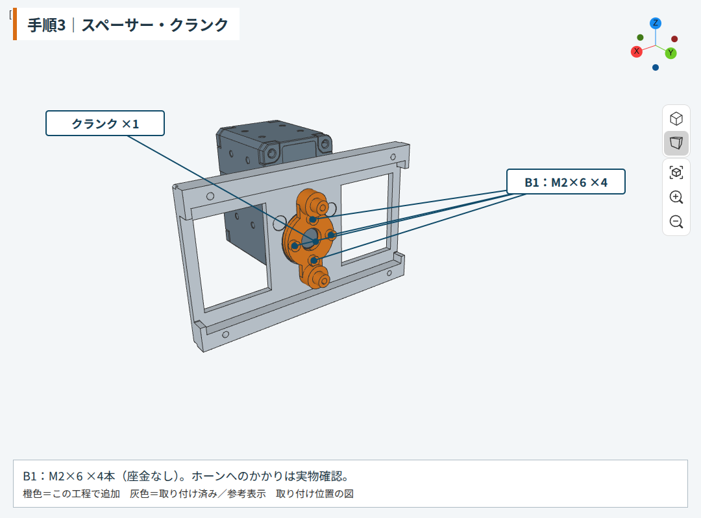

## 手順4／左右スライダと捕捉ナットを配置する

**使用：左右スライダ各1。N1＝M2ナット、厚さ1.6 mm、6個（スライダ支点2＋爪固定4）。この手順で新しく使うボルト・座金なし。**

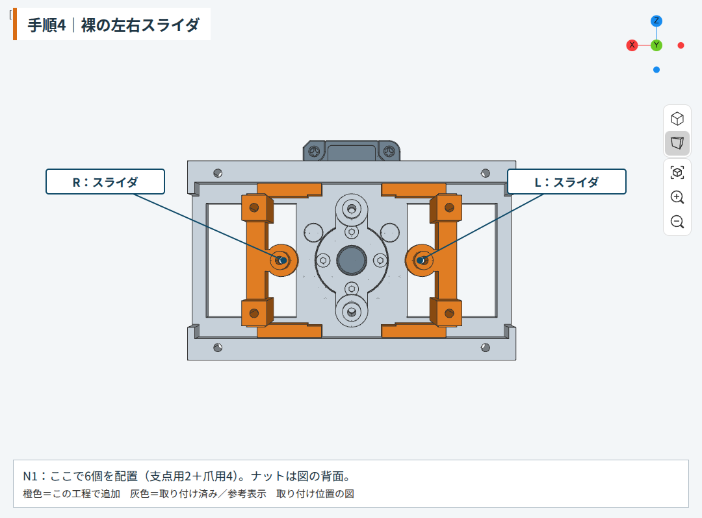

- 左右スライダの支点用ナットを1個ずつ、爪固定用ナットを2個ずつ受け位置に入れる計画です。
- 正面図の奥がナット側です。背面図では見ている方向が逆になるので、Lが画面左・Rが画面右になります。ナットの受け位置と向きを背面から確認します。
- 爪をまだ付けず、スライダを枠の前方から収めます。
- 内側のシューが中央を向き、左右が逆になっていないことをCADと照合します。

**確認：** ナットが受け位置に入り、工具で対向保持できること。既存検証では支点ナットの保持を補助するベンチ治具候補がありますが、実保持・組付けは未確認です。接着でナットを固定する方法は本書では指定しません。

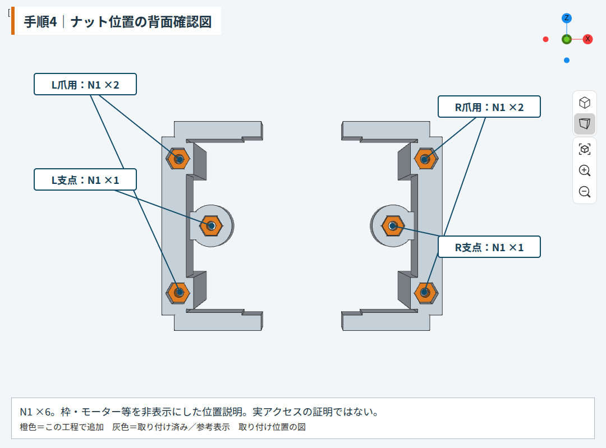

## 手順5／左右リンクを印刷肩に掛ける

**使用：リンクL/R各1。この手順で新しく使うねじなし。**

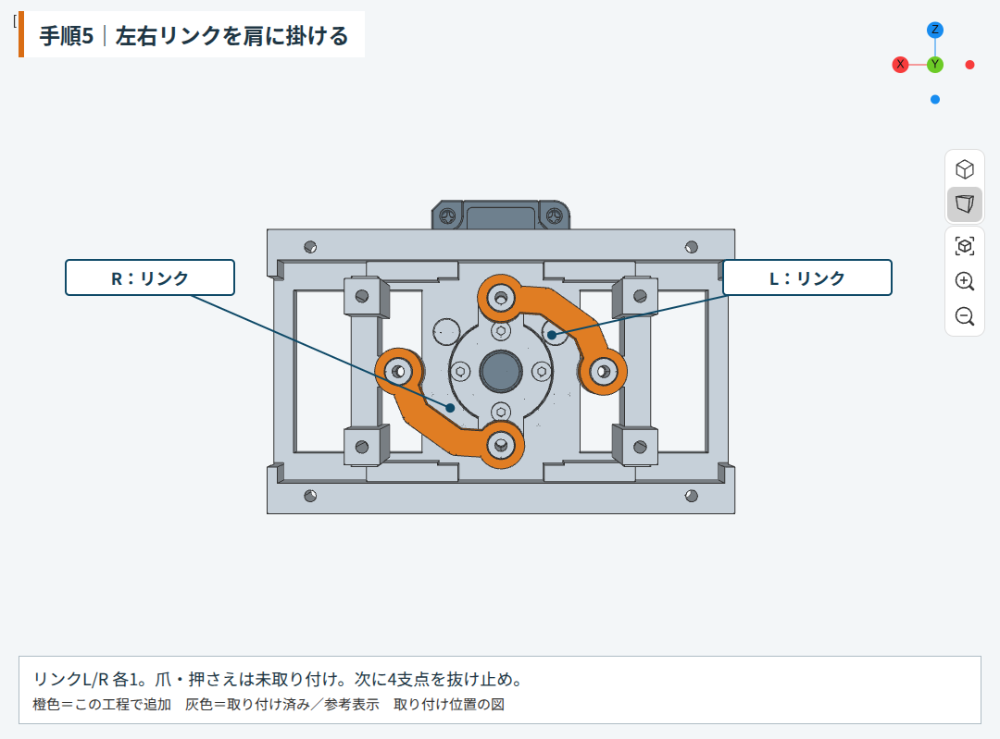

- 左リンクを左側のクランク支点とスライダ支点、右リンクを右側の2支点に配置します。
- リンクの大きい穴は、ねじ軸だけで支える穴ではなく、印刷された肩に掛ける構造です。
- 指先の爪や上下押さえはまだ付けません。支点の背面へアクセスできる状態を保ちます。

**確認：** 4箇所ともリンクが肩に掛かり、左右の部品がCADと同じ組み合わせになっていること。次の手順の図は抜け止めまで配置した状態です。

## 手順6／4支点の抜け止めを取り付ける

**使用：B3＝ねじ径2 mm、長さ10 mm、2本。B2＝ねじ径2 mm、長さ8 mm、2本。W2＝厚さ0.5 mmの大径座金、4枚。N1は手順3・4で用意した計4個を使用。**

クランク側のボルトは長さ10 mm、スライダ側は長さ8 mmです。どちらも頭を除く長さです。

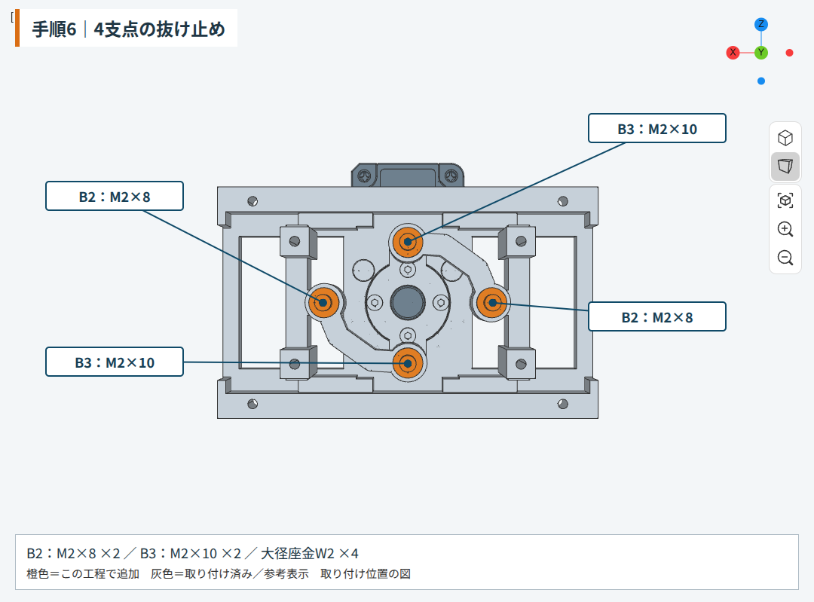

| 支点 | ねじ径 | 長さ（頭を除く） | 左右それぞれの組み合わせ | 合計 |
|---|---|---|---|---|
| クランク→リンク | 2 mm（M2） | 10 mm | B3＋大径座金W2＋M2ナット | 各1組、計2組 |
| スライダ→リンク | 2 mm（M2） | 8 mm | B2＋大径座金W2＋M2ナット | 各1組、計2組 |

ねじ頭→大径座金→印刷肩の端面→本体側のナット、という荷重の受け方を狙った構造です。リンクは肩の周りで回り、大径座金が抜け止めになります。座金でリンク自体を挟み込んで固定しません。

**ねじの名目向き：** 正面図の手前（爪側）から奥（モーター側）へ。ナットは奥側の本体にあります。模式図の矢印は軸の向きを説明し、実際の工具・部品が通る挿入経路を保証するものではありません。

**確認：** 座金が肩に座り、リンクを締め付けていないこと。W2を小さいW1に置き換えないこと。規定トルク、ねじの実かかり、ナットの対向保持、締結後の回転自由度は実物確認が必要です。「回るまでねじを緩めて放置する」を完了条件にしません。

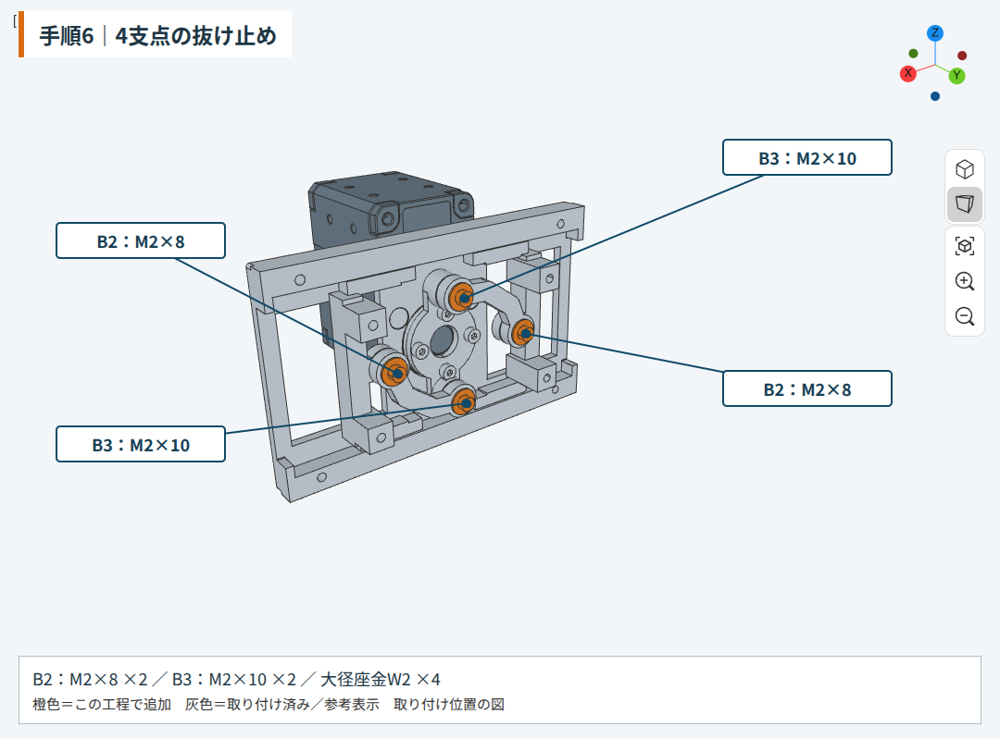

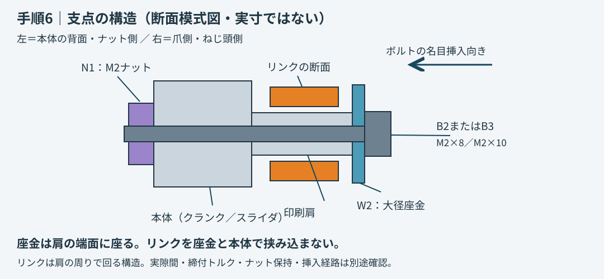

## 手順7／上下押さえを固定する

**使用：B4＝ねじ径2 mm（M2）、長さ12 mm、4本。N1＝厚さ1.6 mmのM2ナット、4個。W1＝厚さ0.3 mmの通常座金、4枚。押さえU/D各1。**

ボルトの長さは12 mmです。頭は含みません。上の押さえに2本、下の押さえに2本使います。

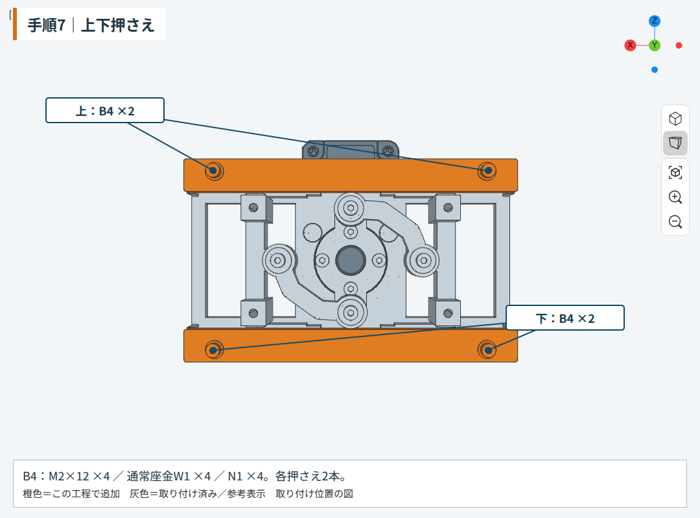

- 本体枠の上下に押さえを1個ずつ配置します。
- 各押さえをM2×12の2本で固定する設計です。4本それぞれに通常座金W1を1枚、ナットN1を1個使います。
- ねじ頭→W1→押さえ→枠→ナットの位置関係をCADと照合します。
- 固定版の正面図で、上の押さえはCAD名 `PG3_cap_D`、下は `PG3_cap_U`。各2本のB4で計4本です。

**確認：** 押さえが正しく座った状態でスライダが拘束されないこと。引っ掛かりを、ねじを未締結のままにすることで解消した扱いにしません。締付トルク・造形公差は未確定です。

## 手順8／左右の延長爪を固定する

**使用：B5＝ねじ径2 mm（M2）、長さ16 mm、4本。W1＝厚さ0.3 mmの通常座金、4枚。N1は手順4で用意した爪固定用4個を使用。V2の爪L/R各1。**

ボルトの長さは16 mmです。頭は含みません。右爪の根元に2本、左爪の根元に2本使います。

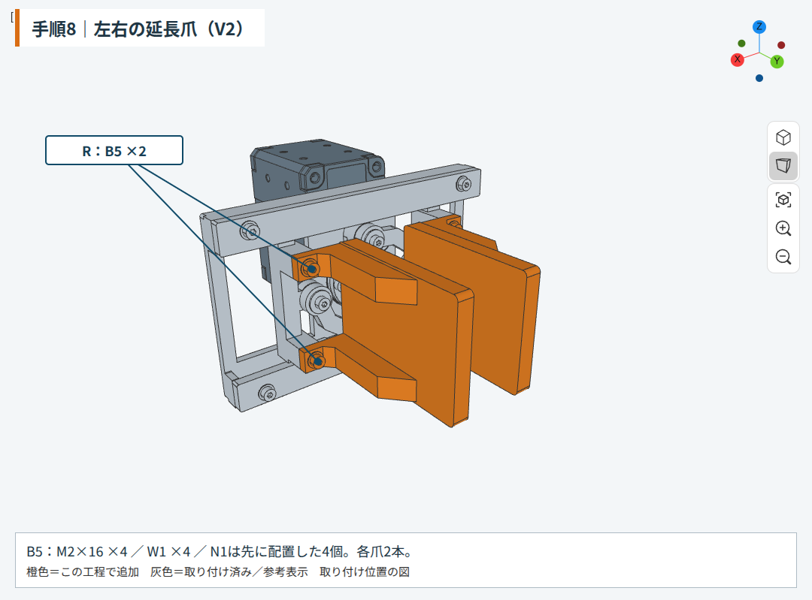

- 把持面が互いに向き合うように左右の爪を置きます。
- 各爪の根元にM2×16を2本、通常座金W1を2枚使います。
- ねじ頭→W1→爪の取付腕→スライダ側の捕捉ナットの配置です。
- 各図の引出線は見えている側のねじ頭に合わせています。Rを確認してから反対側図でLを確認し、各2本・合計4本を照合します。
- 4本の穴位置は延長前の根元位置を維持します。+20 mmの先端側に穴を移しません。

**確認：** V2の延長爪を使い、左右のナットが空回りせず、爪の根元が浮いていないこと。爪先のたわみ・強度・250 g保持はこの組立図では確認できません。

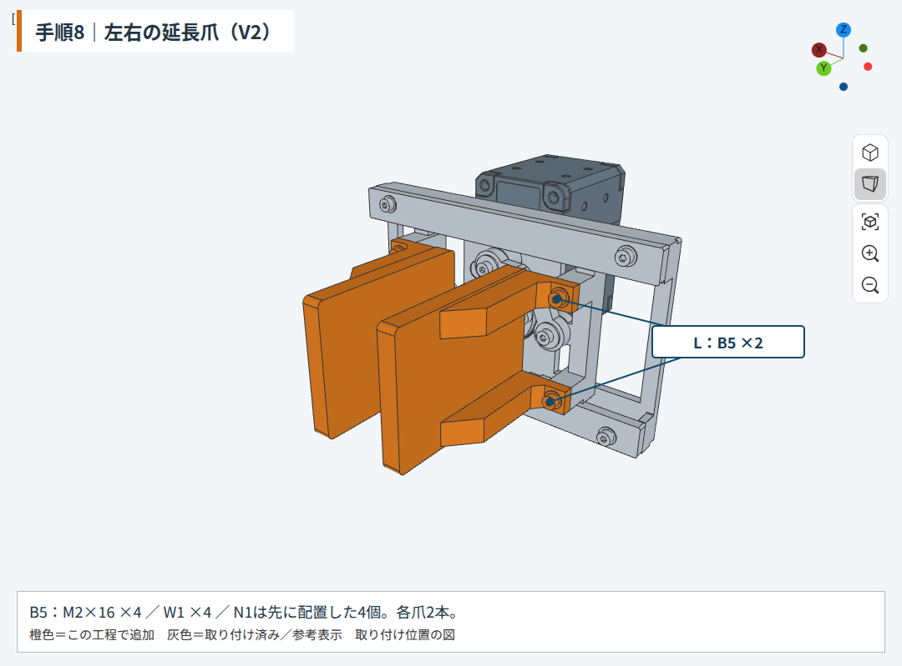

## 手順9／左右パッドを貼る

**使用：28×20×1 mmのパッド×2。新しいねじなし。**

- 左右の内側の把持面へパッドを1枚ずつ配置します。厚さ1 mmは接着層を含みます。
- C9の配置基準は爪先端から1 mm内側、高さ方向中央です。V2ではパッドも爪の延長と同じ+20 mmだけ前へ移動しています。
- 先端へねじを追加せず、左右のパッド位置をCADと照合します。

**確認：** 左右で厚さ・位置が揃い、開閉部へ接着剤が入らないこと。シート材・接着剤・保持性能は未選定／未確認です。

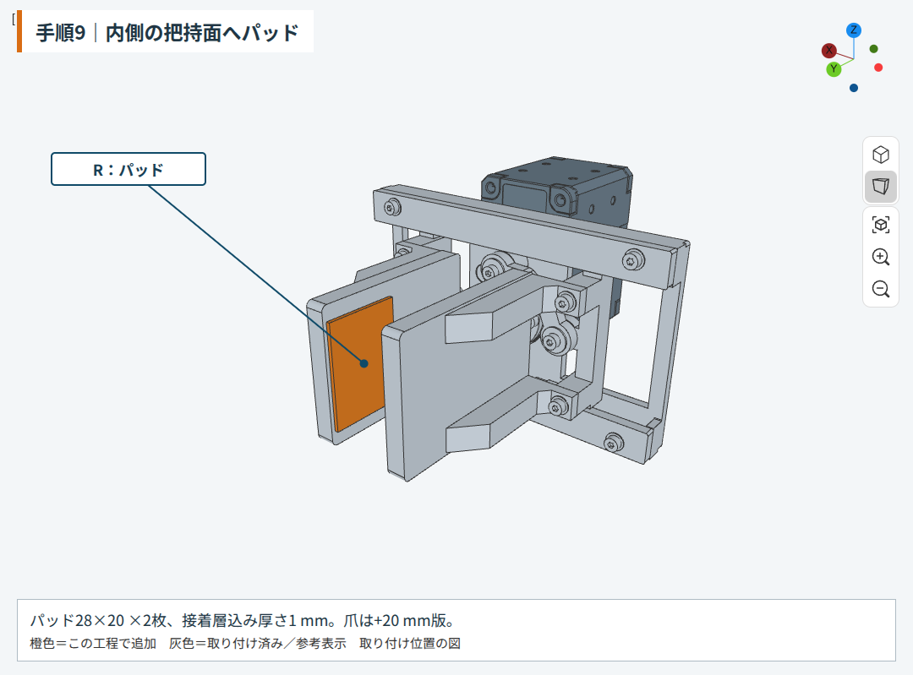

## 手順10／締結・動き・残数を点検する

**新しいねじなし。通電・シリアル操作・モーター指令は本書の範囲外です。**

| 点検項目 | 記録すること |
|---|---|
| 数量 | B1 4本、B2 2本、B3 2本、B4 4本、B5 4本、B6候補2本。ナット12・座金12 |
| ケース固定 | 工程2の適合確認結果。未確定なら組立完了としない |
| 4支点 | 肩・W2・ナットの座り、リンクの回転拘束、実ねじのかかり |
| 案内と爪 | 押さえ締結後の拘束、左右の配置、亀裂、根元の浮き |
| ホーン | ねじの底付き、スペーサー、クランクとの相対位置の写真 |
| パッド | 左右位置と接着層込みの厚さ |
| 未確認 | 締付トルク、材料、印刷条件、摩擦、保持力、繰返し耐久、実開閉端 |

モーターを無理に手回ししません。CADの25〜135°は機構の相対角で、サーボへ送る絶対指令角ではありません。開閉や荷重試験の手順は、実物の固定・ねじ・公差を確認した後、別途定めます。

## 根拠とこの版の確認範囲

- 対象CAD：`studies/low-profile-20260926/outputs/low-profile-250g/CAD/final-version.step`。記録SHA256：`9f58c947753e9229b30939da23ce4c87c1cc85eeb39372518de4ffb98991b93f`。
- 数量の再集計：同じSTEPを読んだChili3Dの部品名。[cad-inventory.json](cad-inventory.json)に保存。寸法は部品表の設計値で、実ねじの計測ではありません。
- ねじ規格：`docs/FASTENER_BOM.md` §1、`specs/pg3_candidate_bom.yaml`のPG3部分。旧P06・旧カメラの項目は本書へ取り込みません。
- 組立順・肩・座金：`references/pg3-c9/PG3_C92_J28/docs/ASSEMBLY_AND_ACCEPTANCE_ja.md`、同`reference/C7/source/design.py`、`scripts/review_pg3_pivot_stacks.py`。
- V2変更：`studies/low-profile-20260926/work/low-profile/design.py`、同studyの`SERVICE.md`と`HANDOFF.md`。爪先・パッドの延長で根元締結位置は保持されています。
- ケース固定の未確定事項：`docs/PG3_ID5_ONLY_DESIGN.md` §1・4。旧`docs/ASSEMBLY_AND_CALIBRATION.md`は別方式を含むため、このPG3の組立順の根拠には使っていません。

この版では部品の表示切り替えと画像保存だけを行い、CAD形状、原本、部品の位置、ハードウェアを変更していません。実組立の挿入経路と対向保持を通した工程検証は未実施です。

自己レビューの記録：[5回のレビューと改善](REVIEW.md)。この作成手順のスキル：`skills/cad-assembly-manual/SKILL.md`。

## 巻末／ねじ・ナット・座金の必要数（1台分）

グリッパ単体1台分の一覧です。予備分は含みません。工程をまたいで使う同じナットは1個として数えています。寸法の単位はmmです。

| 記号 | 部品 | ねじ径・その他寸法（mm） | 長さ・厚さ（mm） | 必要数 | 取り付け箇所 |
|---|---|---|---|---:|---|
| B1 | 六角穴付きボルト | M2 | 長さ6（頭を除く） | 4本 | クランク→ホーン |
| B2 | 六角穴付きボルト | M2 | 長さ8（頭を除く） | 2本 | 左右スライダ側の支点 |
| B3 | 六角穴付きボルト | M2 | 長さ10（頭を除く） | 2本 | 左右クランク側の支点 |
| B4 | 六角穴付きボルト | M2 | 長さ12（頭を除く） | 4本 | 上下押さえ、各2本 |
| B5 | 六角穴付きボルト | M2 | 長さ16（頭を除く） | 4本 | 左右爪の根元、各2本 |
| B6 | ケース固定ねじ候補 | M2.6皿タッピング | CAD全長5（皿頭込み） | 2本 | 枠→ID5ケース。実物適合は確認待ち |
| N1 | 六角ナット | M2、二面幅4 | 厚さ1.6 | 12個 | 支点4・上下押さえ4・爪4 |
| W1 | 通常座金 | 外径5・内径2.2 | 厚さ0.3 | 8枚 | 上下押さえ4・爪4 |
| W2 | 大径座金 | 外径7・内径2.2 | 厚さ0.5 | 4枚 | 支点4。W1に置き換えない |
| P1 | 把持面パッド | 幅28・長さ20 | 厚さ1（接着層込み） | 2枚 | 左右爪の内側、各1枚 |

| 区分 | 合計 |
|---|---:|
| ねじ | 18本（M2ボルト16本＋B6候補2本） |
| ナット | M2 ×12個 |
| 座金 | 12枚（通常8枚＋大径4枚） |
| パッド | 2枚 |

B6は実ケースの穴・座面・ねじ種類との適合が未確定です。M2ボルトは頭を含まない長さ、B6候補のCAD全長は皿頭を含む長さです。実ねじの品番・材質・締付トルクとパッド材料は未確定。カメラ・アームのねじはこの表に含みません。
