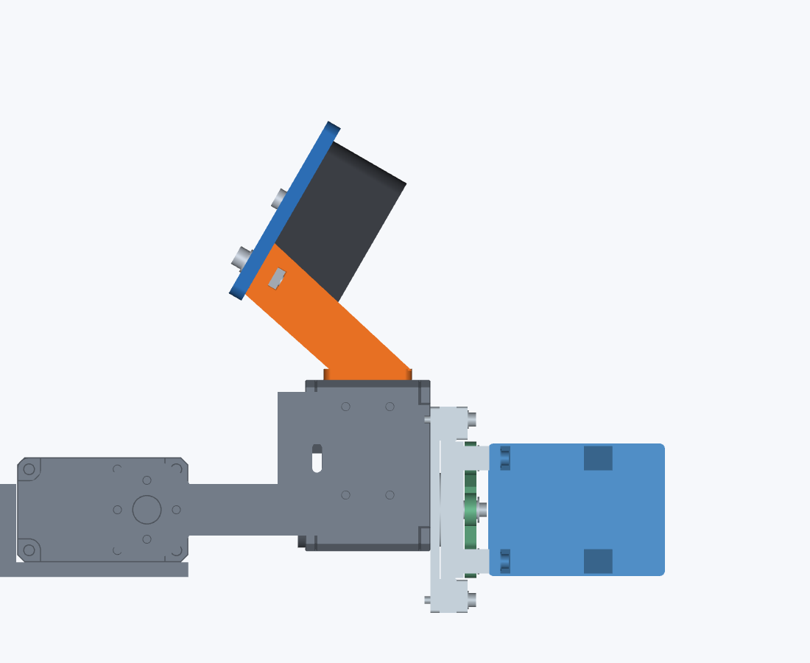

# 低位置D405・20mm爪延長の比較結果

今回の推奨比較対象は [修復済みOnshape V2](https://cad.onshape.com/documents/29e8557c76e89bcf64f50566/v/f6162b4adc88af9d07f1194a/e/d5415bf725ba822741b01703)。参考SO101の約30°に合わせた低配置を実現した。一方、爪延長で把持物のレバーが長くなり、負荷と手首可動範囲では不利になる。強度も改善した、と一括して評価しない。

|比較|旧compact|採用E20_P30_Y165_Z235|
|---|---:|---:|
|下向き角度（+Y基準）|75°|30°|
|ガラス中心 Y / Z|185 / 250 mm|165 / 235 mm|
|爪延長|0 mm|20 mm|
|ID5上面からカメラ群全高|82.70 mm|70.30 mm（-12.40 mm）|
|カメラ群の仮定質量|117.23 g|105.29 g|
|爪/パッドの追加質量|0 g|13.36 g|
|比較部分の250g手首モーメント|0.350412 N·m|0.383540 N·m（+9.45%）|
|手首物理角|以前の範囲|-124〜+102°（合計18°減）|

## 選定範囲

5,040光学候補→356通過→33候補を実マウント化→31静的通過。30°を成立させる最小延長が比較グリッド内で20 mmだった。その20 mm/30°群で最も低い候補を採った。25/30 mm延長ならさらに低くなるが負荷増が大きい。最下方2候補はカメラと台座/ねじの交差で棄却。全候補の [SELECTION.md](SELECTION.md) と実数JSONを保持する。大域的最適性は主張しない。

## 力学と耐久性

静的モーメントは M = Σ(m g l) で同じ条件を比較した。対象250 gを20 mm前進させるだけで約0.04903 N·m増える。比較にはカメラ群、250 g対象、爪/パッドの変更差分を含め、変わらないアーム/グリッパ重量を含めていない。PLA1.24、パッド1.1 g/cm³等の質量仮定であり、材料未指定の実測値ではない。

参考レバー16.7→36.7 mmを同断面の一様片持ち梁とすれば、応力は約2.20倍、たわみは約10.61倍になる。実際の爪は補強リブを持つため、この近似を実形状の耐久性判定には用いない。根元Y<203.6 mmと取付穴を保存し、先端だけ延長した。実材料、層間強度、造形方向、締付、クリープ、摩擦、連続モータートルクは未確定。

## 視野と形状

マウント/アーム/ケーブル込み、3対象×左右両眼で最小可視率93.28%、最小軸距離78.685 mm。848×480の75 mm基準はPASS、720pの100 mm基準はFAIL。実カメラの深度性能は未検証。

保存CADの非CAM5部品236件中、左右爪/パッド4件を変更し232件を保持。2爪+2マウントは有効な単一solid、水密STL。23開閉姿勢の各6,100対象ペアを旧新比較し、新規/増加干渉なし。共通の接触0 mmと取付隙間0.15 mmの8件は一般隙間FAILのまま記録。手首は2°刻み×開中閉3状態で範囲を制限した。連続全関節の無干渉を証明するものではない。

12本の段階別工具包絡はPASS、完成状態の台座4本はアクセスFAIL。台座を先に固定する組立順序を採用した。[GEOMETRY.md](GEOMETRY.md) / [SERVICE.md](SERVICE.md) に失敗と未知を残す。

## OnshapeとURDF

Free/public、headless Playwrightの通常UIを使用し、今回の直接APIは0件。既存文書を別文書へコピーしてSTEPを更新し、12Composite/13mateを再検証した。V1の左右パッド誤所属は全構成部品の動作行列から発見し、UIで修復して11姿勢全件を再取得した。最終版はV2。

UI STEP → `yuki-inaho/urdf_from_step` → Pixi/OCCT8.0.1で、262部品から12新メッシュ、16link/15jointを生成。441閉路残差最大3.47e-17 m、11native姿勢の並進差8.78e-9 m、回転差5.34e-8 rad。実V1不良・軸反転・単位誤りを拒否する検査も通過。運動学モデルであり、慣性・駆動定格・実機校正は未設定。[robot/README.md](robot/README.md) を参照。

## 成果物と保存

- [スクリーンショット付きマニュアル](MANUAL.html) / [PDF](MANUAL.pdf) / [Markdown](MANUAL.md)
- [最終V2 STEP](../../../../../../../../3d-printed-dynamixel-gripper/studies/low-profile-20260926/outputs/low-profile-250g/CAD/final-version.step)、[設計元STEP](../../../../../../../../3d-printed-dynamixel-gripper/studies/low-profile-20260926/outputs/low-profile-250g/CAD/Robot_250g_low_profile_D405.step)
- [最終URDF](../../../../../../../../3d-printed-dynamixel-gripper/studies/low-profile-20260926/outputs/low-profile-250g/robot/model/robot.urdf)、[変換器と再現方法](CONVERTER.md)
- [作業書](WORKDOC.md)、[API使用記録](API-USAGE.md)、[検証JSON](robot/validation.json)
- 途中保存: 設計 `6117edb`、変換器 `1b2cea3`。最終保存情報は `DELIVERY.md` に記録する。

デジタル比較と運動学検証を完了した候補であり、実物耐久性保証・製作承認は行っていない。
