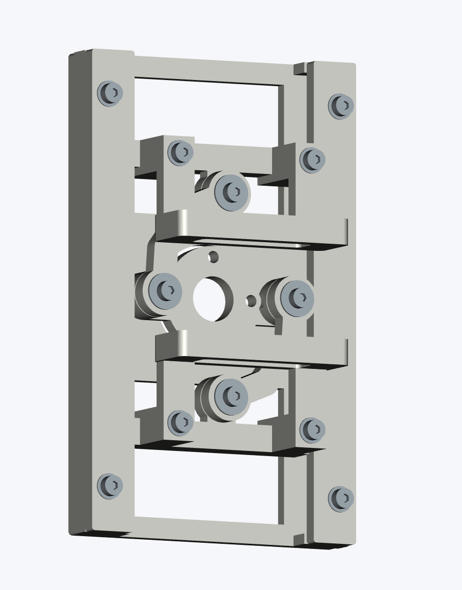
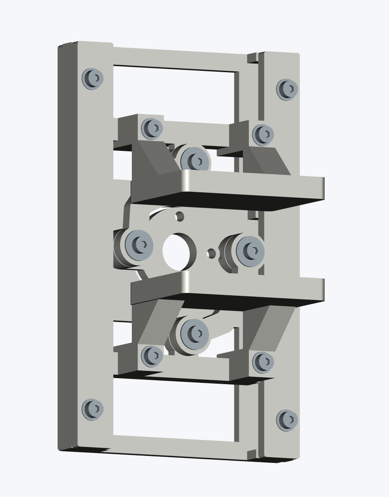
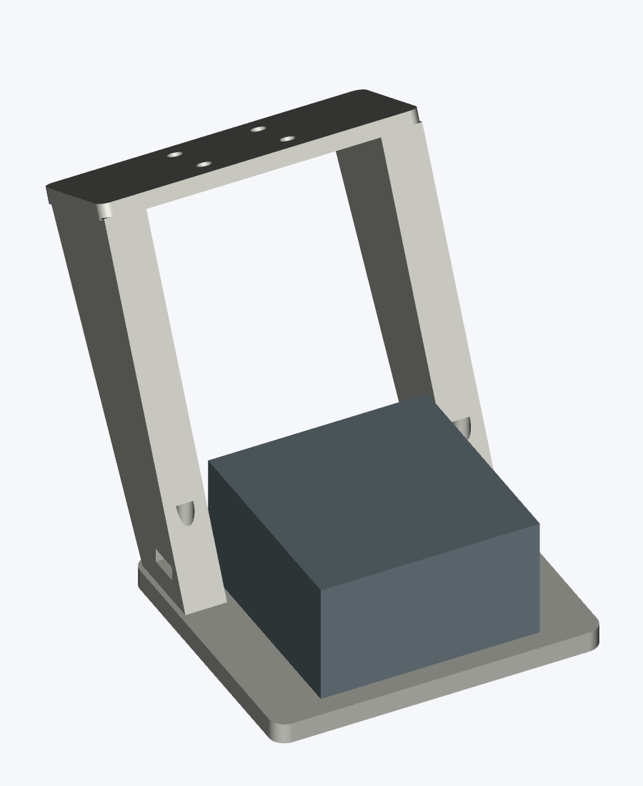
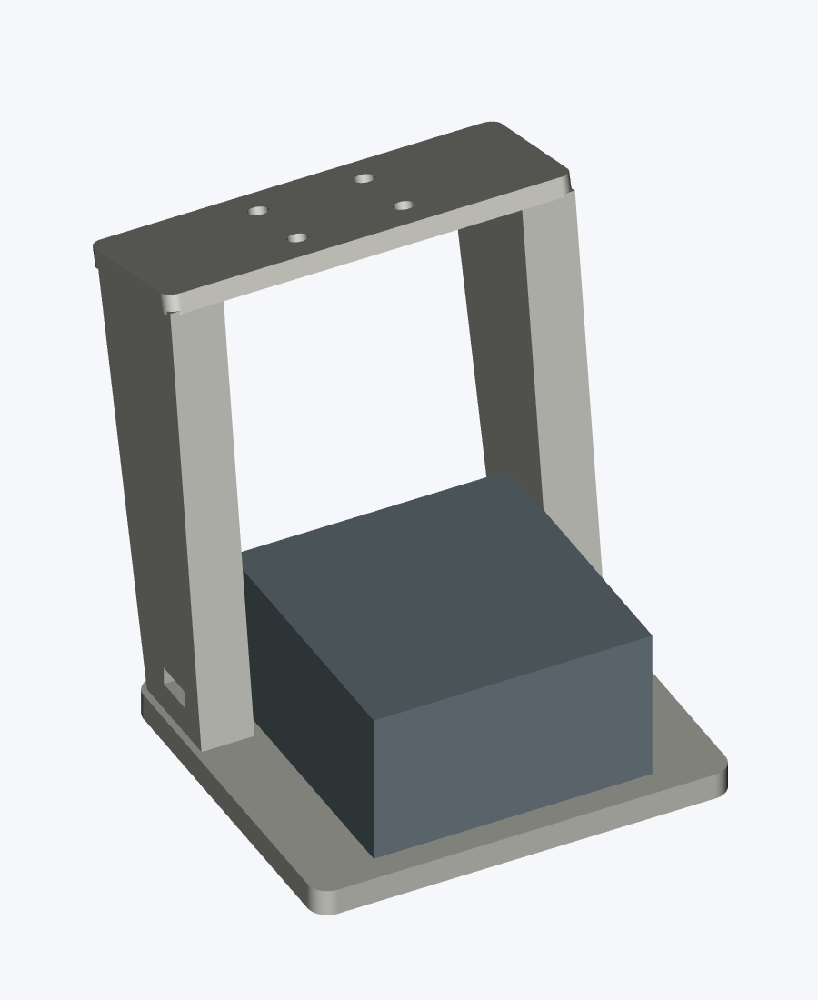
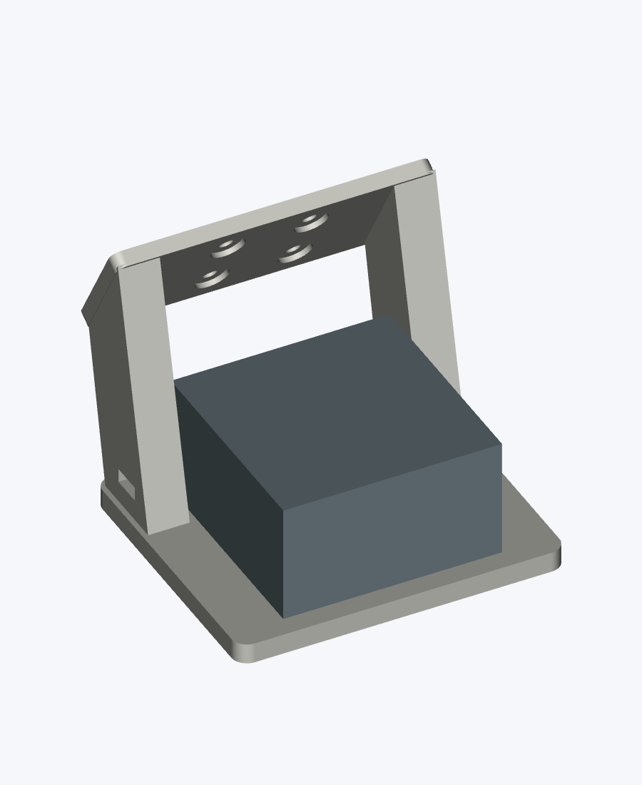
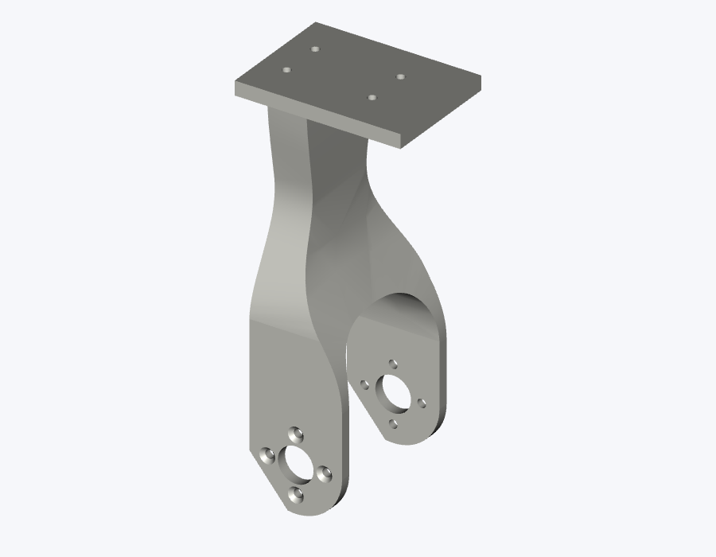
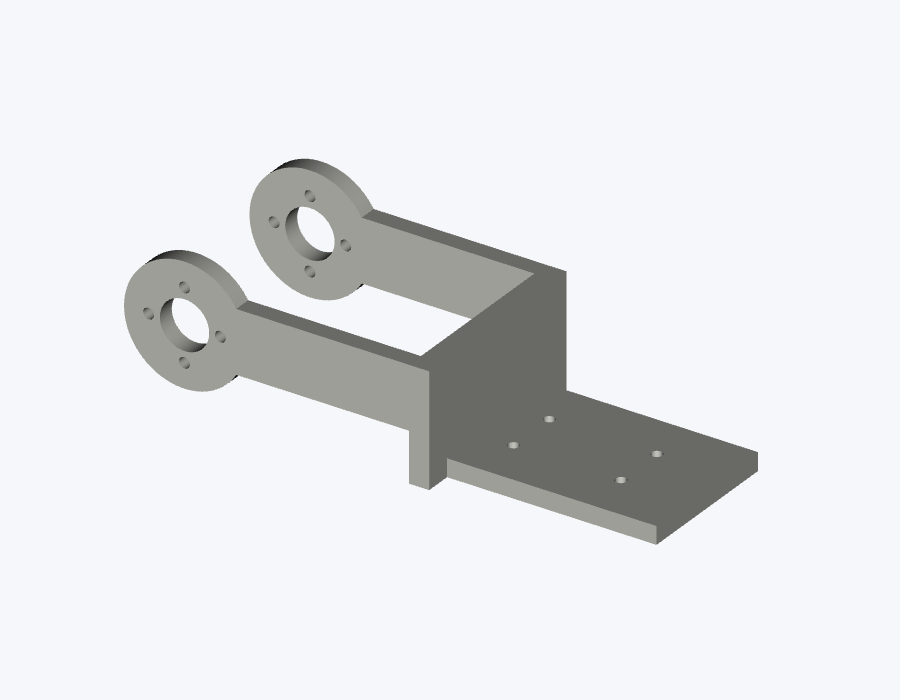
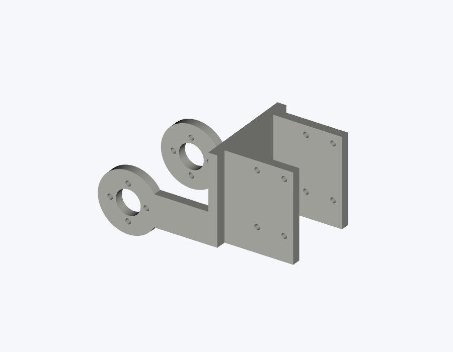
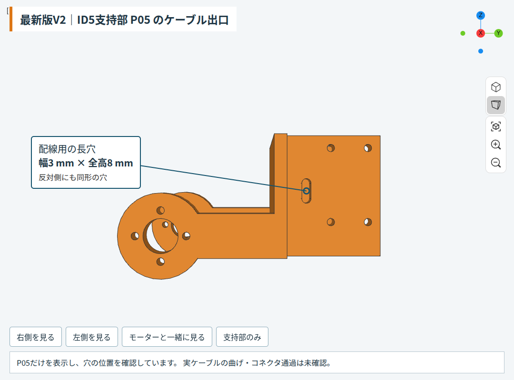
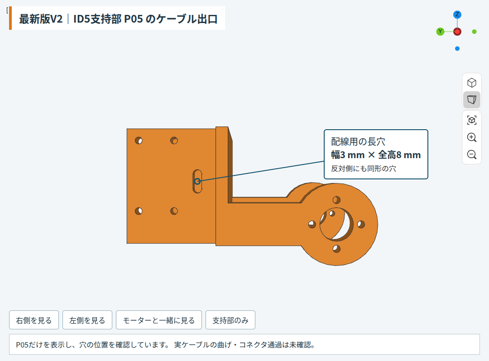

# 実物写真3枚と保存CADの版照合

2026-10-03。写真の見える特徴を、保存済み設計の比較画像・寸法・改訂記録と照合した。以下は外観からの推定であり、実物寸法、造形ファイル、裏面、モーターIDの確認ではない。

## 結果

| 写真 | 有力な版・系統 | 判断材料 | 確定していないこと |
|---|---|---|---|
| 1：グリッパ | **PG3 C92の旧C7爪が有力** | 角枠、丸い中央クランク、4支点と大径座金、爪ごとの2本固定がPG3と合う。細い爪板と補強のない取付腕はC7の比較図に近い。C9の幅広い連続接触板・三角リブが写真では見えない | 爪の窓が正面から見えず、前後長も未実測。枠・押さえの微小逃げ加工やスライダ版は断定できない。C7より古い同系統を完全には排除できない |
| 2：D405ホルダー | **長尺R5系が有力。9/24の65°版が第一候補** | 大きい角丸取付板、左右の長い支柱、外側のナット装填開口と半円状の穴がR5に合う。写真と同じくカメラ取付板を下にした向きで比較した。30°低配置版の短い支柱・斜めのモーター取付座とは外観が異なる | R5派生75°短縮版も似るため、写真だけで65°と75°を確定しない。D405固定穴、座ぐり深さ、実物板厚はカメラの下に隠れる |
| 3：アーム | **全XL430向けR3系のリンク構成に近い** | 曲がった肩リンク、丸い4穴の関節取付部、長いコの字延長、末端の角形ケース支持板がR3のP03/P04/P05比較図に近い | 写真1面ではR1/R2との差や局所修正の有無を確定できない。全モーターの銘板・個数・バスIDは未確認。CADのM番号を実物IDとして扱わない |

「初期版に近い」という見立ては、**細い旧爪と長尺D405ホルダーについて支持される**。3部位が同じ時期に印刷された一式である証拠はない。アーム写真にはPG3とカメラホルダーが装着されておらず、これら3部位の実物接続成立までは確認していない。

## 爪の比較

| 設計 | 爪の接触板の前後長 | 識別点 |
|---|---:|---|
| C7 | 12.1 mm | 板に窓がある、三角リブなし |
| C9 J28 | 28.0 mm | 窓なし、外側の三角リブあり |
| 最新低配置V2 | 48.0 mm | C9から先端を20 mm延長。根元と取付穴は保持 |

寸法は写真から測ったものではない。C7の `finger_start=32.7 / finger_end=44.8`、C9の `finger_end=60.7`、V2の先端20 mm延長から得た設計値。爪板の前後長または窓を確認できれば、C7とC9/V2の識別を強められる。

C7→C9は爪2個に加えスライダ2個も変更する改訂。旧スライダと長い爪の混用は、その改訂の検査対象ではない。共通の枠・クランクに見えることを、混用成立の証拠にしない。

## カメラホルダーの比較

写真で上に見える横桟は、R5なら**モーター側の取付座**に相当する。床に接している幅広い板が**D405取付板**。写真の机上の向きを、アーム装着時のカメラ俯角として読まない。

R5 65°のモーター取付座上面とD405取付板のなす鋭角は25°、75°版なら15°、最新30°版なら60°。これは設計の面角で、写真から測定した角度ではない。部品の面角または造形元ファイル名で、65°と75°の区別を確定する必要がある。

モーメント比較は版名だけで読み替えない。9/26の既存比較は**75°短縮版→30°・爪+20 mm版**で、比較部分の手首モーメントは0.350412→0.383540 N·m（+9.45%）。この数値はカメラ群・250 g対象・爪/パッド変更差分の計算で、変わらないアーム重量を含まない。写真の長尺65°ホルダーの実測モーメントではない。

### D405固定ねじについて

R5 65°、75°派生、30°低配置の設計はいずれも **M3×6 mm・2本・座金なし**。取付板4 mmから座ぐり1 mmを差し引いた有効板厚3 mmに対し、ねじ込み3 mmとなる。設計に合う座ぐりと板厚が写真の実物にもあることは、裏面が見えないため未確認。写真からボルト長を実測したとは扱わない。

## アームの比較

## マニュアルへの反映

作成済みの `temp/gripper-assembly-20261003/MANUAL.*` は、**最新低配置V2（爪+20 mm）**を対象にしている。写真のC7候補の完成外観・パッド寸法として適用しない。共通ねじの配置・設計長は引き継がれているが、写真の実ねじ長と現物組立の成立を確認した意味ではない。冒頭へ写真の版照合注記を追記した。

## 追加確認：最新版のID5ケーブル出口

ユーザーが手元の旧P05にケーブル出口がないと報告。最新版V2の `CAD/final-version.step` を読み直し、`ARM_P05_wrist_XL430` の左右側壁に配線窓が存在することを確認した。各窓は設計幅3.0 mm、全高8.0 mm、端部R1.5 mm。原R3のP05では材料内にある窓中心の6点が、最新版では空間になっている。窓の隣の2点は原版・最新版とも材料内で、位置の取り違えを対照確認した。除去体積176.548668 mm³も既存窓r2記録に一致した。

これは最終保存STEPに窓が残っていることの確認。実ケーブル径、コネクタ通過、曲げ半径や実物の取り付け成立を確認した意味ではない。証拠は [cable-exit-final-step.json](cable-exit-final-step.json)。窓の位置は既存の [側面図](../../outputs/pg3-id5-p05-windows-r2/P05_windows_X.png)を参照（赤い3本は診断用の仮線）。

### ブラウザ表示と単体ファイル

最終V2が読み込まれているChili3Dの262末端要素からP05だけを表示し、左右の長穴を拡大確認した。専用ボタンで右側・左側・モーター参考表示・支持部のみを切り替えられる。形状は編集していない。

単体ファイルは [outputs/cable-exit-v2-20261003-r1/README_ja.md](../../outputs/cable-exit-v2-20261003-r1/README_ja.md)。最終STEPから組立world座標を保って抽出したSTEP/STLで、再設計や印刷姿勢の指定ではない。再読込STEPは有効な単一solid、元抽出形状とのBoolean差分0 mm³。独立コピーの交差・差分対照を確認し、旧穴なしR3との負例は176.548668 mm³の差分、既存窓r2単体との比較は差分0 mm³。STLは閉じた1成分で、面の向きと正体積を確認した。

以前の `set2all.gcode` はPG3の11部品＋D405台の2部品のみで、P05は含まれていない。グリッパとカメラ台を更新しても、アーム側の旧P05に配線窓は追加されない。窓付きにする対象はこのP05支持部。実物の部品対応・配線・強度の確認と製作承認は引き続き未確認。

## 根拠と再現

- 写真1：[1888e231…](../../photos/1888e231-325b-418e-98ae-6c22d27de5d0.jpeg)
- 写真2：[2ddc64b8…](../../photos/2ddc64b8-5f81-4700-96b3-8c76d2ba9f82.jpeg)
- 写真3：[397595be…](../../photos/397595be-d993-4ee8-a447-036ff3046646.jpeg)
- C7/C9比較：[comparison.png](../../references/pg3-c9/PG3_C92_J28/images/comparison.png)、C7 `reference/C7/source/design.py`、C9 `source/jaw_revision.py` と `docs/ASSEMBLY_AND_ACCEPTANCE_ja.md`。
- 長尺カメラ：[CAMERA_MOUNT_ID5_D405_R5.md](../../docs/CAMERA_MOUNT_ID5_D405_R5.md)、`gripper_design/camera_overhead_d405_r5.py`。
- 9/24印刷セット：[README_ja.md](../../outputs/print-set2-gripper-camera-k1c-20260924/README_ja.md)。D405 R5部品が収録されるが、写真の実物がそのG-code由来かは未確認。
- 9/26比較：[REPORT.md](../../studies/low-profile-20260926/outputs/low-profile-250g/REPORT.md)、[SELECTION.md](../../studies/low-profile-20260926/outputs/low-profile-250g/SELECTION.md)。
- アーム：[R3 STEP](../../../../../../3d-printed-dynamixel-gripper/references/arm-r3/arm_XL430_R3.step)、[R3説明](../../references/arm-r3/README_ja.md)。
- 比較描画：[render_photo_version_check_20261003.py](../../../../../../3d-printed-dynamixel-gripper/temp/render_photo_version_check_20261003.py)。既存ソースとR3 STEPから形状を読み、表示色・カメラ視点だけを変えた。写真は加工していない。R5派生の比較形状は既存設計パラメータを用いたもので、新たな製作候補ではない。
- 設計寸法の抽出：[cad-measurements.json](cad-measurements.json)。

再現：`rtk proxy env DISPLAY=:1 uv run --no-sync python temp/render_photo_version_check_20261003.py`。比較画像を目視確認した。ドナーCAD、実機、シリアルポートには変更・操作を行っていない。
