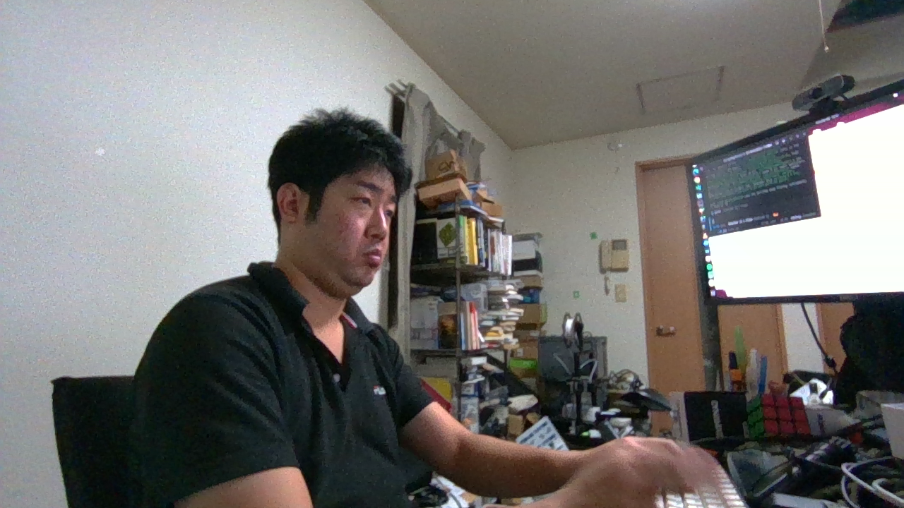
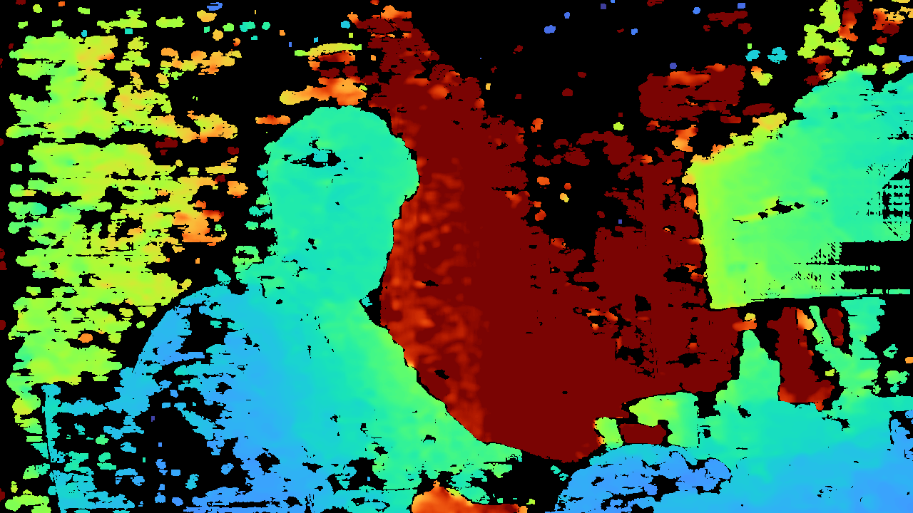
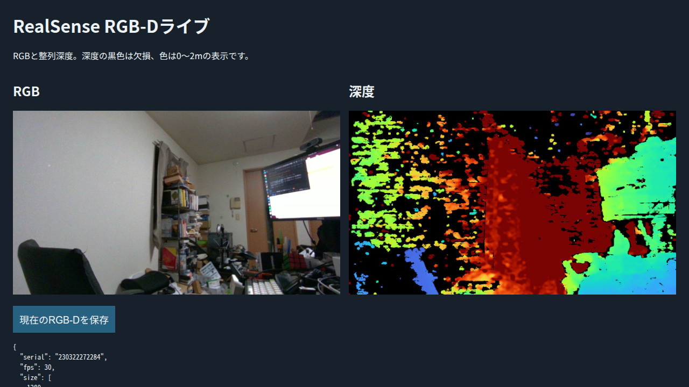

# 撮影コード・スキル・作業レビュー（2026-10-04）

作業：Codex単独、18:47開始。対象：my_dynamixel_arm_sandbox、開始HEAD `4b5f392`。
撮影済み20姿勢の原画像・実記録は変更していない。今回ロボット通信・動作なし。

## 変更と検出した問題

|対象|レビュー結果と変更|
|---|---|
|旧写真/新RGB-D command loop|`photo_session.run_commands`へ共通化。stop/finish/stage/ready生成の重複を除去。CLIは維持。|
|停止後の再開|3か所の読込みを共通化。5件だけでなく、5つの異なるIDの保持writeがあることを検査。|
|準備処理|実機設定取得・前session照合・送信範囲設定を分離。基準・速度・期限・許容幅は拡大していない。|
|RAM復元|共通のwrite＋readbackを使用。全5台OFF確認を復元より先に行う。異常停止は保持する。|
|撮影ready|以前のrun、動作開始、終了、異常時のreadyを無効化。削除失敗でも緊急保持を妨げない。|
|時刻|ready.jsonの既存Unix時刻は維持。photo_ready JSONLのISO時刻をfloatで上書きする不具合を修正。|
|撮影ログ読込み|短いlogの最初の完全recordを捨てる不具合を修正。途中のJSONL writeは採用しない。|
|画像と角度|現行ready・全5台保持・fresh telemetryを確認。前READ以降に受信したframeを要求し、後READを新たに取得。hardware同期とは記載しない。|
|機種依存|D435専用laser/emitter設定をD405へ書く処理を修正。SDK supportsで設定し、取得/export/closeは既存capture実装を再利用。|
|移植性|旧photo/release CLIも--config/--deviceを受付。Protocol2/1Mbps/IDs1..5という既存の制約は固定。SDK依存はそれぞれの既存uv環境で型検査。|
|画面|古いcapture-01固定の点群リンクを削除。実保存フォルダにexportしたHTMLを開く。|

共通化と保存境界の検証追加で、撮影関連の総行数は単純な減少ではない。
旧3controllerは656→527行（追加の接続引数を入れる前の測定）、共通処理と
撮影証拠検査を合わせた時点では718行。改善指標は重複の解消と、最大循環的複雑度
**39→10**。品質ゲートの上限10は変更していない。

## テストのpruning

開始314件。既存41件を削除し、共通処理/保存不具合の検出と通信境界の代表確認10件を
残した最終対象は**283件**。テスト件数を目標値に合わせる削除は行っていない。

|削除・縮約|検出を残した場所|
|---|---|
|許可RAM値の正常系10反復、別のSDK正常系、goal windowの重複|10/30°の実SDK→serial emulator試験に、全ID事前照合・命令種別・範囲・復元のassertを集約。|
|非WRITE命令の9反復|全opcode拒否はreadonly試験。motion側にSYNC_WRITE拒否の委譲確認1件を残す。|
|同一拒否理由の角度値、EEPROMアドレス、alias ID、重力偏差の反復|異なる拒否条件を代表ケースで保持。整数の未許可値とbool、各RAM境界/幅、EEPROM/RAM拒否を残す。|
|torque失効の直接unitと一部30°fault重複|open/hold/return各phaseの失効、逆方向、他関節移動、alias、早期progressと全体期限を保持。|
|定数表の写し・dry-run重複|CLI default確認を既存plan試験へ集約。送信前guardと実SDK結果は保持。|
|旧23/new20姿勢の全表ループ|長距離staging・yaw両端・狭い範囲・release/restoreを代表姿勢で検証。異なる停止/補正失敗ケースは保持。|

検証：全体suiteを一回 **281 passed / 17.96秒**。その後の小変更は
対象photo/controller **27 passed**、追加通信委譲 **1 passed**、最終共有処理 **9 passed**。
同じ全suiteは繰り返していない。readonly/Rust schema v2の交換契約は変更していない。
ruff、ty（observerと各native環境）、複雑度、diff検査、CLI helpを確認。
技能3件はquick_validate成功。最初のvalidatorはobserver環境にPyYAMLがなく失敗し、
既存gripper環境で実行して解決。依存の新規インストールは行っていない。

別作業が途中で追加した`tests/test_apriltag_family.py`と`uv.lock`等は今回の編集対象外。
その時点の全体ruffにはAprilTag試験のimport順序エラーがあった。今回の変更範囲の
検証と区別し、他作業のファイル/lockを上書きしていない。
同作業のdrawing試験にはmodule作成途中のcollection errorもあったため、最終の
対象収集/ruffは`tests/test_apriltag*.py`を除いて実施した。今回対象283件の収集は成功。

## 接続した手先D405

|項目|実観測|
|---|---|
|カメラ|Intel RealSense D405 / serial230322272284|
|接続|USB3.2 / FW5.17.0.10|
|実SDKprofile|Color / Depth / IR1 / IR2、1280×720@30fps|
|画像|RGB、raw uint16 depth、aligned depth、IR左右をPNG保存|
|校正|metadata.json / calibration.tomlにSDK内部・外部パラメータと実depth scale|
|depth scale|0.0000999999974738 m/count|
|深度非ゼロ率|18:59:48のframeで65.07%（対象領域の品質合格ではない）|
|ブラウザ|http://127.0.0.1:18109/、専用headless PlaywrightでRGB/深度の1280×720読込み確認|
|配信実測|15.76 Hz。SDKprofileの30fpsとは別の値。|
|原データ|~/data/xl430-arm/2026-10-04/d405-usb-check/|

RGBは作業者と室内を撮影している。低照度ノイズがあり、把持対象はまだ画面内にない。
次の撮影では対象の距離/構図/深度を一枚で先に確認する。
公式D405 ideal rangeは7–50cm：[RealSense D405](https://www.realsenseai.com/products/d405-series/)。
実機近接領域を確認せず、室内の深度が取得できたことを把持用画像の合格とはしない。

SDKのsupported optionsとprofileは実機で取得した。公式SDK：
[librealsense](https://github.com/realsenseai/librealsense)。
元capture checkoutのユーザー変更は維持。

D405 RGBのinverse Brown–Conrady係数は非ゼロ。現行pinhole点群exportの実行は
期待どおり拒否された。D405用SDK deprojection対応は今回未実装で、点群成功とはしない。
ロボット観測はnull。新たなencoder校正、自己干渉/ケーブル干渉の検証、動作再撮影は
カメラ確認に含めていない。ライブserverは新実装で起動済み、古いD435 serverは未変更。

追加技能：[rgbd-arm-pose-capture](../../../skills/rgbd-arm-pose-capture/SKILL.md)。
既存bounded-servo-motion/robot-park-pose-definitionから案内し、撮影手順の二重実装を避ける。
作業書は同じフォルダのWORKDOC.mdに保存。今回の変更はローカルのレビュー可能な差分。

## 後続依頼による保存対象の追加

上記は撮影レビュー終了時点の記録。その後ユーザーがcommit/pushとAprilTag作業の
レビューを依頼したため、撮影リファクタリング・技能・D405証拠もまとめて保存対象へ追加。
AprilTagを含む全体検証は[後続レビュー](../apriltag-review/REPORT.md)を参照する。
