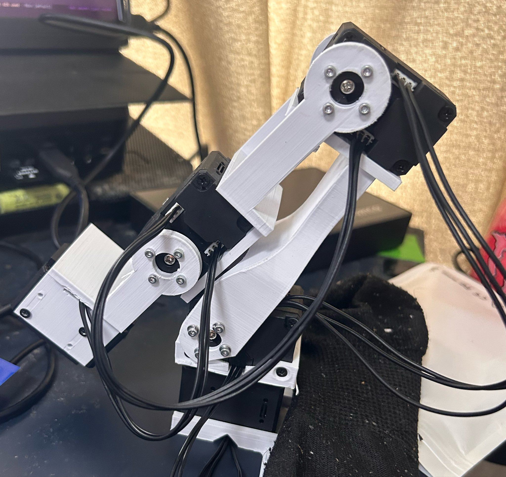
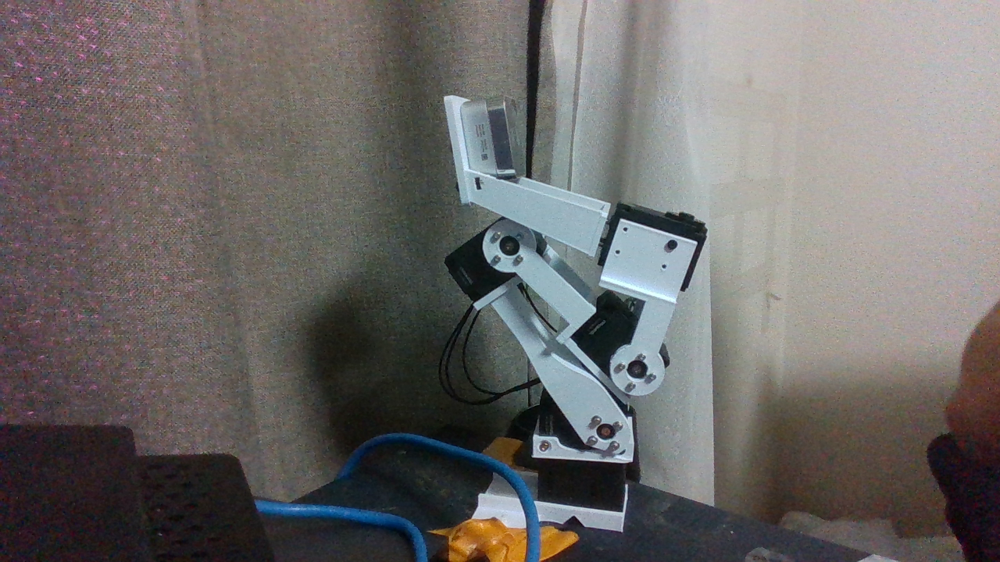
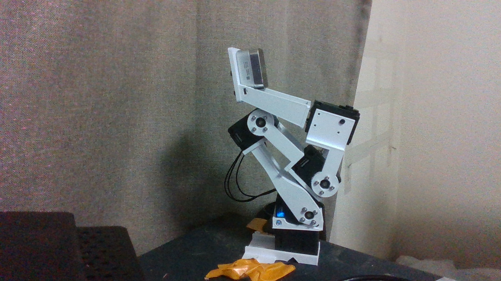
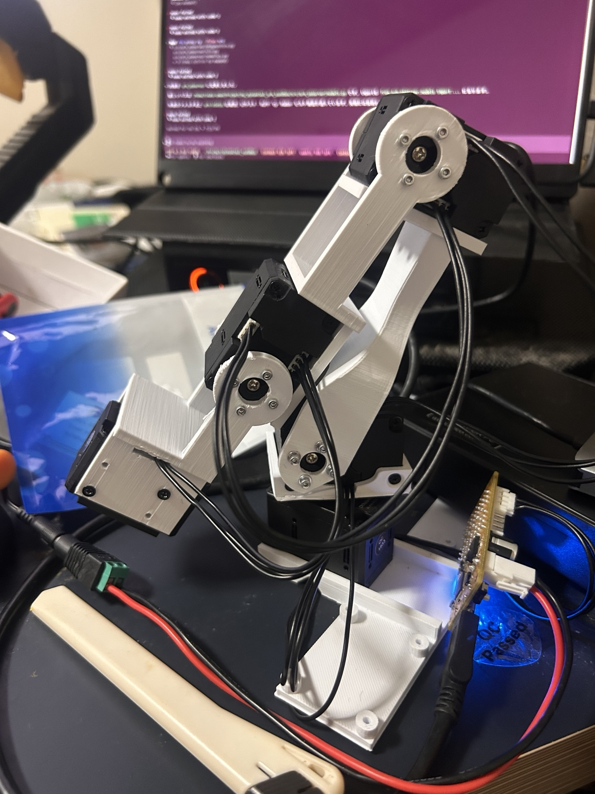
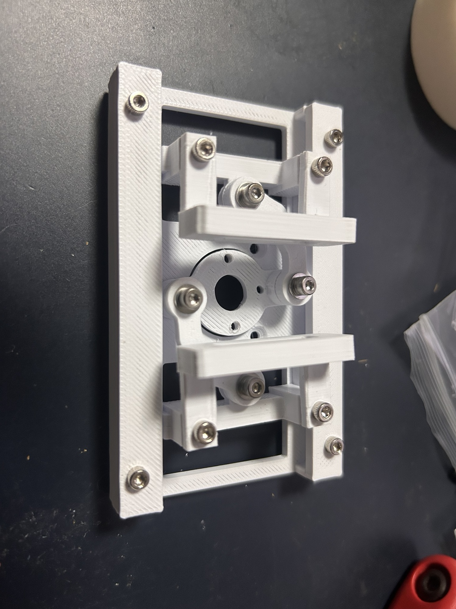
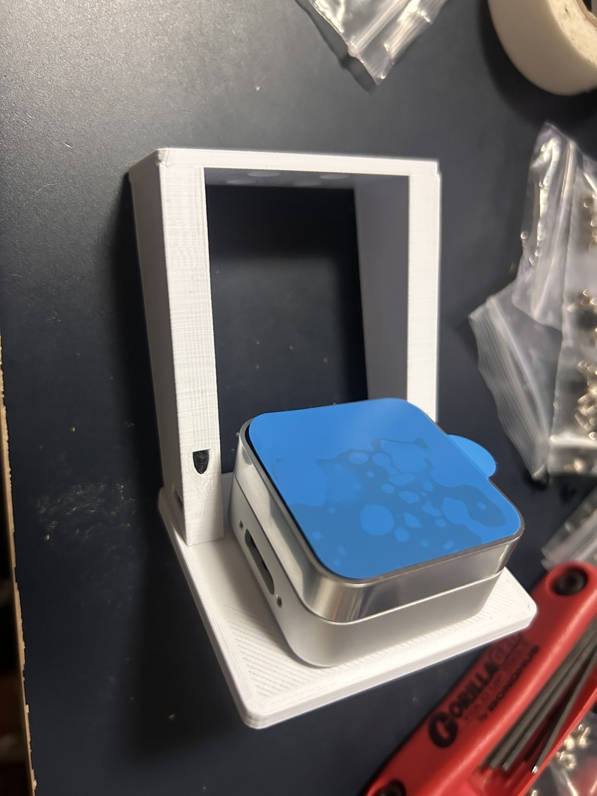
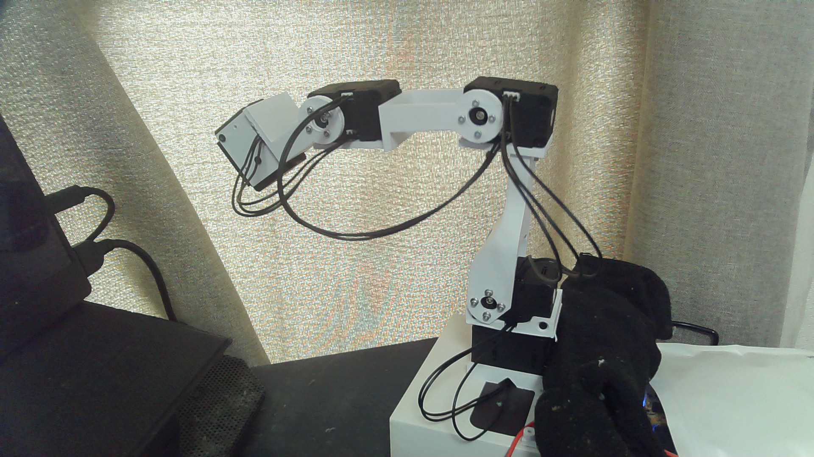
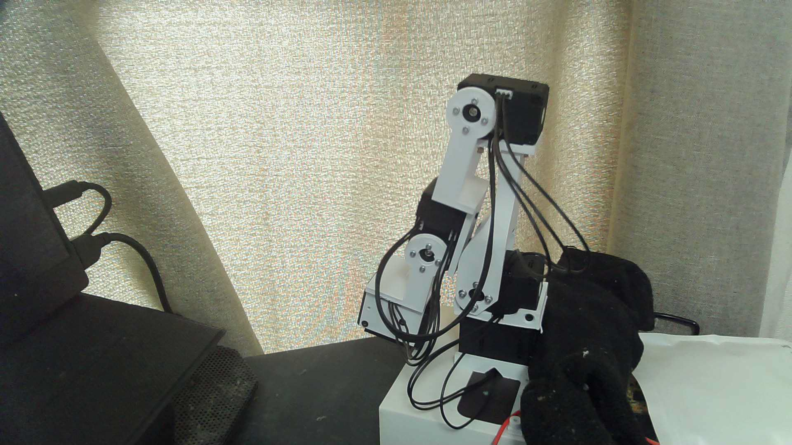
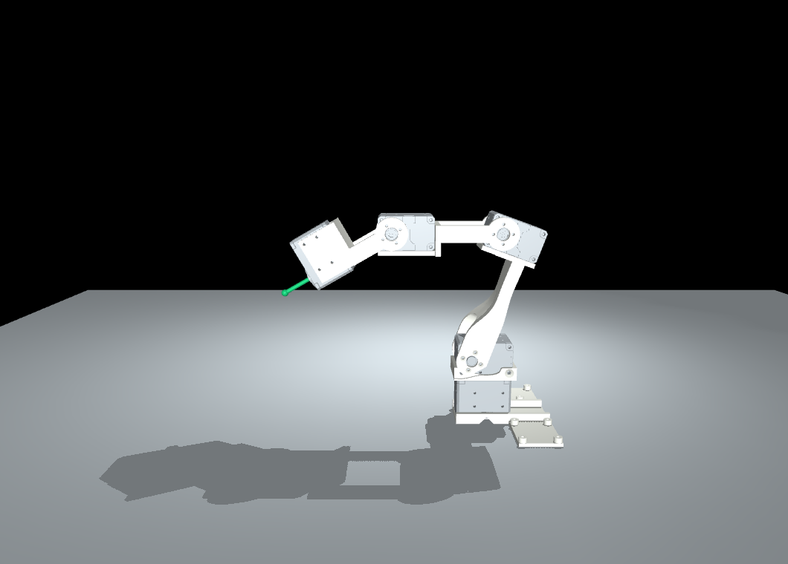
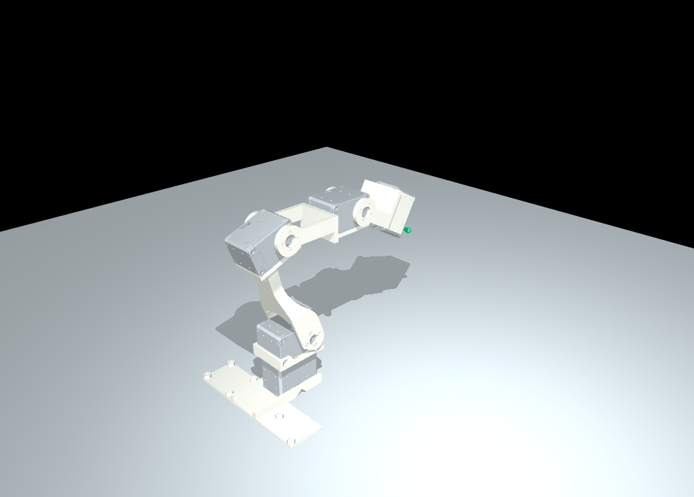

# 現行アームの仕様・写真・モデル来歴

更新：2026-10-04。対象はユーザーの手元の**全XL430・爪未装着・D405取付済みのアーム**。D405のUSBは未接続とユーザーが報告。外観はR3系に近く、表示には受領済みR3の選択部品を使う。印刷元ファイルの完全一致と、実機エンコーダからCAD角への絶対校正は未確定。

## 現物の構成



上のユーザー写真はホルダー装着前の記録。撮影時刻は確定していない。黒いクッションはあるが、実際に重量を受ける点・支持力・摩擦係数は測定していない。



ユーザーがD405取付済み・USB未接続と報告。外部D435の実RGB画像でも、長尺ホルダーの上のD405本体を確認した。写真だけで装着角や校正値は確定しない。取得条件は1280×720/30fps、D435 serial922612070196、USB3.2。生RGB-Dの正本は `~/data/xl430-arm/2026-10-04/realsense-camera-check/capture-20261004-182023-913145/`。

| 部分 | 現物の状態・推定 | 根拠と確度 |
| --- | --- | --- |
| アーム | XL430×5、台座旋回・肩・肘・手首と末端モーター | 保存した実機READでID1〜5/model1060を確認。リンク外観はR3 P03/P04/P05に近い。細かな改訂版は未確定 |
| ID5支持部 | 旧P05系の箱状支持部 | 現物に配線出口がないというユーザー報告。新しい窓付きV2の装着証拠はない |
| グリッパ | 別置き。PG3旧C7の細い爪が有力 | 細い爪・窓・三角補強なしの外観。枠/スライダの微小改訂までは未確定 |
| カメラ | D405と長い旧ホルダーを取付済み。D405のUSBは未接続 | ユーザー報告と18:20の外部D435画像。長尺R5系、2026-09-24の65°版が第一候補。似た75°短縮版との区別は未確定 |
| 給電 | 18:38時点は電源接続、全5台Torque OFF | 独立実READで9.0〜9.1V、速度0/error0。電源装置OUTPUTはPCから操作していない。13:06のOFF申告は過去の状態 |

## カメラ付きの現行ニュートラル待機姿勢

ユーザーが2026-10-04に指定した基準は、腕を畳み、D405がモーター群の上に安定してある姿勢。
開始参照count（ID1〜5）は **[2102,3473,1147,3398,1951]**。絶対CAD角の0°ではない。
外部D435から基準RGB-Dと内部/外部カメラパラメータを保存した。



20候補は台座[-30,-15,0,15,30]°×肘の開き[10,15,20,30]°。ID2/4/5は保持。
各姿勢2.5秒静止、原RGB-Dを個別確認して取得。手首-5°の候補は追従未達停止を記録し、再試行しなかった。
18:38:02に復帰/全OFF/設定復元、18:38:41の実READは[2112〜2113,3473,1153,3392,1951]、速度0/error0。
新基準への既定20count復帰誤差以内で、脱力後も安定。台座や支持位置が変われば再確認する。
生データ正本は `~/data/xl430-arm/2026-10-04/d405-mounted-rgbd-1827/`。
固定焦点だが低照度ノイズはあり、RGB-D/encoderはhardware同期していない。別時刻と前後READを保存している。

現行FKモデルは `specs/urdf_fk_r3_d405.json` と
`outputs/urdf-fk-r3-d405-20261004-r1/`。元R3＋長尺R5＋D405名目外形/2ねじ、29mesh/4DoF。
ビューアの例示角[0,-20,-20,-30]を実機角と扱わない。光学軸の実登録と絶対角校正は未確定。



## 引用リポジトリと版

ユーザーは印刷元について `low_cost_robot の all-xl430-arm` と回答している。これは来歴の手がかりで、Gitブランチと後から受領したR3 ZIPの内容が同一である証明ではない。

| 資料 | リポジトリ/モデル | 確認した版・識別子 | 関係 |
| --- | --- | --- | --- |
| 元プロジェクト | [AlexanderKoch-Koch/low_cost_robot](https://github.com/AlexanderKoch-Koch/low_cost_robot) | upstreamの採用commitは未確定 | yuki-inaho版のfork元。元の混成モーター構成を現物へ読み替えない |
| ユーザーのfork | [yuki-inaho/low_cost_robot](https://github.com/yuki-inaho/low_cost_robot) | ローカルbranch `fix/cadre-geometry-review-20260918`、HEAD `f29f33b3b99320b3ad35171ec08897bede459fbb` | [固定commitの制御実装](https://github.com/yuki-inaho/low_cost_robot/blob/f29f33b3b99320b3ad35171ec08897bede459fbb/low_cost_robot/dynamixel.py)を公式仕様と照合 |
| 印刷元の申告branch | 同forkの `feature/all-xl430-arm` | ローカルref `ecdc3e6d7424d93718e24388e5ee9654d8e9d348`、2026-06-14T13:34:03+09:00 | [固定commit](https://github.com/yuki-inaho/low_cost_robot/tree/ecdc3e6d7424d93718e24388e5ee9654d8e9d348)。Webのbranchページ取得に制約があり、refはローカルgitで確認 |
| R3受領CAD | `XL430_collision_R3_20260919.zip` → `references/arm-r3/arm_XL430_R3.step` | ZIP SHA256 `59555ef4011b80ab2d9367a9ab9def62925f6991658a6a256dfdf8911aa734b9` | 元ブランチとは別の受領設計。今回の表示モデルの形状入力 |
| 別の旧CAD | `low_cost_robot_all_XL430_CAD_20260919.zip` | SHA256 `848ea763de613280a87d0988260252e60682d40be1a8c200018e3cbb4e003fe7` | 54外部重なりを記録した旧静的モデル。R3と同一として扱わない |
| この作業repo | [yuki-inaho/3d-printed-dynamixel-gripper](https://github.com/yuki-inaho/3d-printed-dynamixel-gripper) | 記録時branch `main`、HEAD `e5b2c277e26a2fb5d42c13963b3cb259cc60edd1` | 本仕様・FK追加はこのHEADに対する未commitの成果物 |
| 実機作業repo | [yuki-inaho/my_xl430_dynamixel_arm_sandbox](https://github.com/yuki-inaho/my_xl430_dynamixel_arm_sandbox) | 記録アーカイブcommit `6a38ff8e2d405e99cfd6e00a9caa800376a05a26`、private/main | スタンバイ/電源OFF/会話/画像記録。ローカルfolder名は `my_dynamixel_arm_sandbox` |

R3 STEP SHA256：`3274fab5106793de65f86bb3391a660ff6d09eb55a9d8166e072e9d1bd4625cb`。[軸資料](../references/arm-r3/joints.json) SHA256：`988890dd93df387ce22f027c10f9e7f3e4f7ac1841e010f18fd7aec47eebf7a7`。[R3説明](../references/arm-r3/README_ja.md)、[来歴調査](../outputs/arm-current-audit-20261003/source-audit.json)。

## モーターID・役割・保存メタデータ

次表は2026-10-04 10:54:03〜06 JSTの**保存済みREAD**とユーザーの役割確認による。文書作成で再接続・READ/WRITEはしていない。CADのM番号・J番号、URDF名、バスIDは別の名前空間。

| 実機ID | 役割 | モデル番号 | firmware | CAD対応 | FK |
| --- | --- | ---: | ---: | --- | --- |
| 1 | 台座旋回 | 1060 | 43 | M01 / J1 | `cad_j1` |
| 2 | 肩 | 1060 | 42 | M02 / J2 | `cad_j2` |
| 3 | 肘、畳みから開く動きを観測 | 1060 | 42 | M03 / J3 | `cad_j3` |
| 4 | 手首、ID5支持部を傾ける | 1060 | 42 | M04 / J4 | `cad_j4` |
| 5 | 将来のPG3爪開閉 | 1060 | 43 | M05 / 出力軸中心 | ケースはID4のリンクに固定。爪なしのため開閉軸を表示しない |

保存値は全5台で Baud Rate=3、Protocol Type=2、Operating Mode=3、Drive Mode=0、Homing Offset=0、position register limits=0..4095。装置設定の記録で、幾何学的安全範囲ではない。公式仕様ではbaud値3は1 Mbps、mode3はPosition Control、位置分解能は4096 count/rev（0.087890625°/count）。[ROBOTIS XL430公式仕様](https://emanual.robotis.com/docs/en/dxl/x/xl430-w250/)

ID3はcount増加で肘が開くことを映像で確認。ID4は下向きの試行でcountを減少させた。全関節のCADゼロcount、軸符号、組立offset、世界前方との整列は絶対校正済みではない。`Homing Offset=0` やcount2048をCADゼロの根拠にしない。

## 座標とリンク寸法

R3保存world座標：+Yをモデルの前方、+Zを上向きと定義。+Xは右手系の残りの軸。机・カメラ座標との整列は未測定。中心位置は**保存姿勢のCAD設計値**で、写真の測定値ではない。

| 軸/評価点 | 中心 x/y/z（mm） | 回転軸（保存frame） | 親からのURDF origin（m） |
| --- | --- | --- | --- |
| J1 | 0 / 0 / 20.0 | 0 / 0 / +1 | 0 / 0 / 0.0200 |
| J2 | −0.2 / 0 / 56.3 | −1 / 0 / 0 | −0.0002 / 0 / 0.0363 |
| J3 | −0.2 / 14.8 / 164.6 | +1 / 0 / 0 | 0 / 0.0148 / 0.1083 |
| J4 | −0.2 / 104.9 / 164.6 | +1 / 0 / 0 | 0 / 0.0901 / 0 |
| M05軸中心 | −0.2 / 164.9 / 164.6 | 0 / +1 / 0 | J4から 0 / 0.0600 / 0、fixed |

J2→J3中心間距離109.3066 mm（前方14.8 mm/上方108.3 mm）、J3→J4は90.1 mm、J4→M05は60.0 mm。印刷部品全長や爪先位置と混同しない。取り付け姿勢はSTEP世界配置と保存軸に織り込み済み。別資料の `zero_rotation_xyz_deg` を再適用すると二重回転になる。

| 印刷部品 | 役割 | 保存world外接箱 x/y/z（mm、概数） |
| --- | --- | --- |
| P03 | 肩リンク | 44.0 / 46.5 / 107.05 |
| P04 | 延長リンク | 46.0 / 114.85 / 31.75 |
| P05 | ID4→ID5支持リンク | 46.0 / 83.5 / 45.5 |

外接箱は保存向きのCAD寸法。穴径・造形誤差・締結成立はこの値だけでは判断できない。現物の全締結箇所の径/長さ/数量は未検査。設計一覧は[FASTENER_BOM.md](FASTENER_BOM.md)、旧版とV2の差は[組立資料](gripper-assembly-20261003/PHOTO_VERSION.md)。

## 別置きの爪とカメラホルダー



旧C7爪接触板は設計前後長12.1 mm、C9 J28は28.0 mm・三角リブあり、最新低配置V2は48.0 mm（C9先端+20 mm）。写真はC7系が有力。[V2マニュアル](gripper-assembly-20261003/MANUAL.md)を現物C7の完成外観・パッド寸法の証拠には使わない。



R5の長い支柱・外側ナット開口に近い。65°長尺版/75°短縮版の確定には印刷ファイルまたは面角・寸法の確認が必要。最新30°低配置版とは区別。R5設計のD405固定は**M3×6 mm、2本、座金なし**。長さは頭を除く。写真の実板厚/ねじ長を測った値ではない。[R5仕様](CAMERA_MOUNT_ID5_D405_R5.md)、[写真/CAD照合](../temp/photo-version-check_20261003/REPORT_ja.md)

## スタンバイ・電源OFFの実記録



| 状態 | ID1 | ID2 | ID3 | ID4 | ID5 | 証拠の意味 |
| --- | ---: | ---: | ---: | ---: | ---: | --- |
| 13:01:06 スタンバイREAD | 2064 | 3115 | 1969 | 1721 | 2059 | 2/3/4トルクON、1/5OFF。世界角はVLMの概略判断 |
| 13:02:44 元姿勢へ復帰・脱力 | 2064 | 3118 | 1159 | 2050 | 2059 | 全OFFをREAD照合、RAM復元、通信終了 |
| 13:03:12〜22 独立READ | span0 | span1 | span0 | span1 | span0 | 200frames/20Hz、欠測0、全OFF。短時間で大きな移動なし |
| 13:06 ユーザー電源OFF | — | — | — | — | — | ユーザー報告。以下は報告後の画像 |

count列は過去の観測値で、再実行用goalではない。スタンバイはID1/ID5の当時位置を中立に採用、ID2現在近傍、ID3前腕を前方、ID4末端を概ね30°下向きという意図。厳密な世界角は測定していない。



電源OFF基準は空中スタンバイから元の安定した畳み姿勢へ戻す方針で記録した。クッション上面約5 mmという申告はあるが、支持荷重経路・将来の静止安定性は未検証。電源OFF後の通信なし。[保存した作業記録](evidence/STANDBY_20261004.md)

## URDF・FK表示モデル

4回転関節＋固定tool frame。R3原本は6モーター/7印刷部品/217末端要素。現物構成へ合わせM06/P06/P07を除外し、M01〜M05・P01〜P05の**180末端要素、うち55 surface-only要素**を10表示meshに保持。solid数だけで数えない。PG3、D405、実ケーブルは含まない。

実URDFをMuJoCo3.13.0へ直接importし、保存MJCFに照明・非接触の机・tool siteを追加。URDFで `discardvisual=false` / `fusestatic=false` を明示して表示mesh/固定tool frameを保持。[公式URDF拡張](https://mujoco.readthedocs.io/en/3.13.0/modeling.html#urdf-extensions)、[compiler](https://mujoco.readthedocs.io/en/3.13.0/XMLreference.html#compiler)

tool位置はM05軸中心。**爪先/TCPではない**。向きはtool frameの+Y。緑の線は中心から前方45 mmの表示補助で、線の端を手先座標に用いない。色・机は表示設定で、写真の材質再現ではない。





| FK例 | J1/J2/J3/J4（°、CADゼロ基準） | M05中心 x/y/z（mm） | 世界ピッチ |
| --- | --- | --- | ---: |
| CAD保存姿勢 | 0 / 0 / 0 / 0 | −0.20 / 164.90 / 164.60 | 0° |
| 前方・下向き | 0 / −20 / −20 / −30 | −0.20 / 118.93 / 133.13 | −30° |
| 旋回を含む | 20 / −10 / 15 / −20 | −47.11 / 128.86 / 208.83 | +5° |

これらはデモ例で、実スタンバイcountの変換角ではない。内部m/rad、UIはmm/degree。`mj_forward` で配置し、`mj_step` やactuatorを使わない。補間最大0.5°/frame、目標20Hz。停止で古い目標を消費し、次の明示入力まで移動表示を再開しない。

元MJCF・独立XML/NumPy FK・変換後MuJoCoを5姿勢で比較。最大変換差3.33×10⁻¹⁶、10 compiled meshのworld外接箱差2.69×10⁻⁹ m。meshは原OBJとSHA一致。誤った2°の入力を検出する負例、hash改変/非有限/範囲外拒否も検査。[実出力検証](../outputs/urdf-fk-r3-20261004-r2/verification.json)、[URDF](../outputs/urdf-fk-r3-20261004-r2/robot.urdf)、[実行手順](../simulation/urdf_fk/README.md)

## 可動域・未確定の制約

| 範囲/検証 | 状態 | 適用範囲 |
| --- | --- | --- |
| FK UI範囲 | J1±40°、J2±40°、J3±60°、J4±60° | 小さなデモの表示範囲。実機許容範囲ではない |
| R3受領時6軸調査 | 1314有限姿勢、36干渉、全体PASSではない | 他の5軸を保存角にした単軸188例等を含む。全組合せ/連続経路の証明ではない |
| R3旧条件 `q3+q4≥−90°` | 調査由来の候補条件 | 条件だけで全相手の干渉を除外できない。実countへ直接適用しない |
| 現行bare CAD干渉の再検証 | `ERROR_INPUT_BOOLEAN_CONTROL` | 独立Boolean対照失敗が残る。FK成功でPASSへ変更しない |
| 新URDF collision | なし、`collision_certified=false` | visual meshをcollision meshとして認証していない |
| 質量/重心/慣性/effort/velocity | コンパイル用仮値 | 重力保持/落下/加速度/トルクの検証には使えない |
| ケーブル/造形誤差/柔軟性 | モデル外 | 引張り/巻込み、PLAクリープ、外力/対象物重量は未評価 |
| 絶対校正/実可動域 | 未確定 | 概略写真姿勢と差分動作確認は絶対角校正の代用ではない |

[R3有限調査](../outputs/arm-current-audit-20261003/r3-evidence/motion_full.json)。FK一致は同じ配置の再現検証で、自己干渉しないことや給電OFFで落ちないことの認証ではない。

## 制御コード参照時の注意

旧fork `dynamixel.py@f29f33b` はOperating Modeの1byte欄へ2byteを書く経路、電圧144/温度146の扱いのずれ、読み取りに見える操作がTorque書込みを伴う経路がある。XL430のPresent Loadは電流mAではなく、mode5を対応モードと仮定できない。[固定コード](https://github.com/yuki-inaho/low_cost_robot/blob/f29f33b3b99320b3ad35171ec08897bede459fbb/low_cost_robot/dynamixel.py)、[公式control table](https://emanual.robotis.com/docs/en/dxl/x/xl430-w250/#control-table-of-ram-area)

FKツールはSDK・シリアル・live bridgeをimportせず、制御wrapperを呼ばない。最新ユーザー指定によりIKは今回取り下げている。

## 保存と再現

[仕様JSON](../specs/urdf_fk_r3.json)、[変換/独立FK](../simulation/urdf_fk/model.py)、[描画](../simulation/urdf_fk/demo.py)、[browser server](../simulation/urdf_fk/server.py)、[再利用スキル](../skills/urdf-mujoco-fk/SKILL.md)。

写真は原本を加工せずコピー。[画像MANIFEST](images/current-arm-20261004/MANIFEST.json)に原本パス・SHA256・byte数を保存。保存メタデータ/姿勢要約と元記録SHAは[証拠JSON](evidence/current-arm-20261004.json)。HTMLはこのMarkdownからpandocで生成する。

```bash
rtk proxy env MUJOCO_GL=egl uv run --no-sync python -m simulation.urdf_fk.demo --output outputs/urdf-fk-r3-new-run
rtk proxy env MUJOCO_GL=egl uv run --no-sync python -m simulation.urdf_fk.server --output outputs/urdf-fk-r3-20261004-r2 --port 18104
```

生成は新run名を指定。既存出力/referencesを上書きしない。現行状態とモデル候補の仕様を保存したもので、印刷・荷重運用・再通電の指示書ではない。
