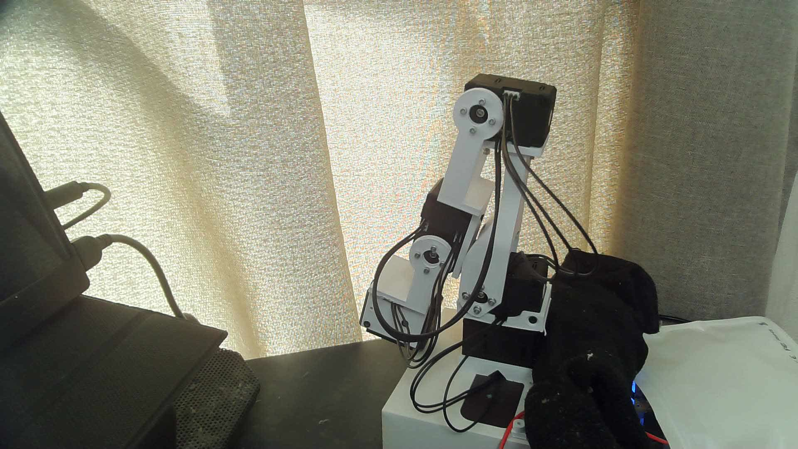
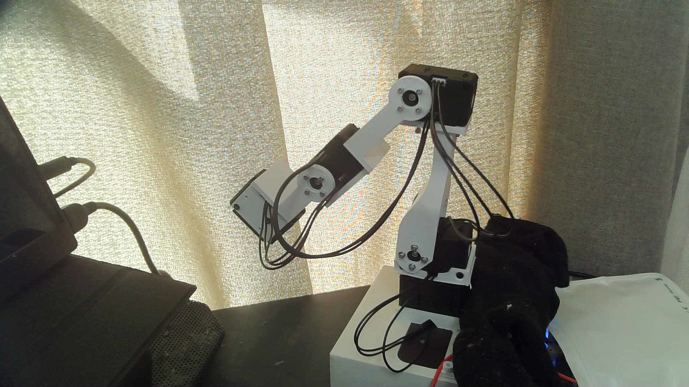
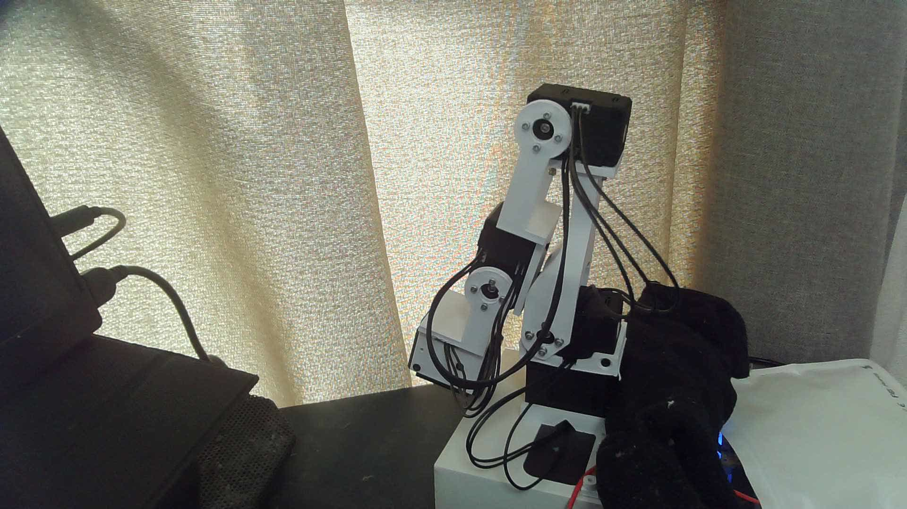

# ID3（肘）30°動作の確認

2026-10-04 12:30 JST。ユーザー指定D9に基づきID3だけを操作した。
USBカメラ再接続後に映像取得を確認し、新しい実機READとdry runを使った。

| 項目 | 結果 |
|---|---|
| 開始 | 1154 count |
| 指定目標 | 1495 count（+341、29.970703125°） |
| 到達 | 1498 count（開始から30.234375°、目標差+3） |
| 復帰 | 1156 count（開始差+2、0.17578125°） |
| 保持 | 約2秒 |
| 書き込み先 | ID3のRAM 64/100/108/112/116のみ |
| 他IDの最大変化 | ID1=0、ID2=2、ID4=1、ID5=0 count |
| 最終状態 | 全5台トルクOFF、変更RAM3項目の復元READ一致、ポート閉鎖 |
| 独立検証 | validation.jsonの17条件すべてPASS |

動画の2秒、26秒、34秒の画像を直接確認した。肩と肘のケース軸の位置が保たれ、
手首が左上へ移動して肘が開き、元の畳まれた状態へ戻った。
ケーブルも追従し、これらの画像では接触は見られなかった。

原動画はactual-motion.mkv（35.009秒、212115025 bytes）。validation.jsonに
画像・動画・実行ログ・前後READのSHA256を保存した。動作用コードのSHA256は
execution-code-hashes.jsonに保存した。offline-gates.jsonは動作前の検証記録であり、
そこにあるexecuted=falseは検証時点の値。実行結果はexecution-result.jsonを参照する。

ID3の相対方向と動作確認が完了した。絶対CADゼロ点は未校正。
この結果だけで全アームの干渉なし可動域、スタンバイ姿勢、無支持の電源OFF姿勢を
承認しない。今回の終了はトルクOFFであり、電源を遮断する操作ではない。
