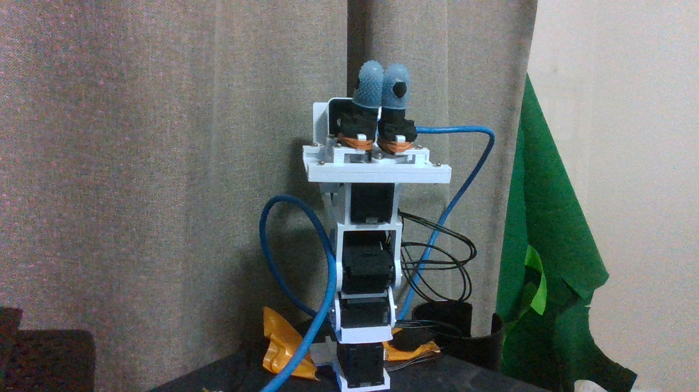

# 現行アームの構成・モデル（2026-10-04）

実機はlow_cost_robotのall-xl430-arm由来、全5軸XL430、R3系リンクが有力。
厳密な印刷改訂番号は未確認。撮影済みの現物特徴からの版同定と、CAD donor版を区別する。
現在はPG3グリッパ、softtip（指サック・foam・橙色band）、D405長尺holderを装着。
外部D435は俯瞰撮影用で腕のリンクではない。

|実機ID|役割|現状の根拠|
|---|---|---|
|1|台座yaw|既存の±30°撮影・ユーザー対応|
|2|肩|旧写真・撮影軸対応、絶対ゼロ未校正|
|3|肘|ユーザーが肘と指定、段階開動作済み|
|4|手首pitch|既存相対撮影、絶対ゼロ未校正|
|5|グリッパjaw|181.41閉/239.50開のユーザーpair確認と今回の二眼開閉|

この表はCADのM01..M06/Jラベルを物理IDに機械的に割り当てるものではない。
donorに6motor occurrenceがあっても実機6台とはしない。fresh primary IDs1..5のみ検出、
モデル1060、1/5 firmware43・2/3/4 firmware42、全secondary255。

引用元は[yuki-inaho/low_cost_robot](https://github.com/yuki-inaho/low_cost_robot)、
ユーザーが指定したall-xl430-armのローカルbranch名は`feature/all-xl430-arm`。
今回読取りで確認した同branch HEADは`ecdc3e6d7424d93718e24388e5ee9654d8e9d348`
（2026-06-14、3D print checklist追加）。このHEADと現物の印刷時点の一致は未確認。
既存制御コードの参照固定commitは
[`f29f33b3b99320b3ad35171ec08897bede459fbb`](https://github.com/yuki-inaho/low_cost_robot/tree/f29f33b3b99320b3ad35171ec08897bede459fbb)。
このcommitが印刷CADの正確な版であるとは確認できていない。
donor STEPはgripper repositoryの`references/arm-r3/arm_XL430_R3.step`、
そのmanifest/jointsを参照してR3運動学モデルを構成している。

perceptionに使ったモデルは[manifest](../models/current_arm_r3_d405_r5_65.json)、
NPZ SHA256 `cc15059b6256b1cf88452d3c85a5a0f8861b08ce00978c9e498f86208ce9dcf0`。
構成はR3 bare arm＋D405 long R5_65。カメラ系21 meshes、metres。
R5 familyは写真と一致が有力、65/75°の区別は未解決で65°はnominal candidate。
**このperceptionモデルには爪がなく、今回の現物PG3/softtip開閉の認識には未対応。**
scanfit外形6solidsは別の静的モデルとして証拠に保存し、whole-arm実装に昇格していない。

制御はProtocol2/1Mbps、独占serial、原則READ。例外の動作は各workdoc専用RAM envelope。
旧low_cost_robotのラッパーにはXL430幅/address照合が必要な箇所があり、そのまま実行しない。
FKだけを今回の対象とし、絶対ゼロ・全域collision-free・IKを承認済みとはしない。
[姿勢認識の検証と制約](ARTICULATED_POSE_RECOGNITION.md)、
[待機/電源OFF姿勢](STANDBY_POWER_OFF_POSITIONS.md)、
[グリッパの実測制約](GRIPPER_ID5_CONSTRAINTS.md)を参照。

最新READは全台OFF、error0。ID5 2091 countで画像上closed。
PWM/PA/PVの復元が確認されても再enable時に無制限profile0を使わず、専用controllerで再設定する。
電源OFFと安定支持は別であり、腕の支え・カメラUSB・台座の状態は各runで再観測する。
