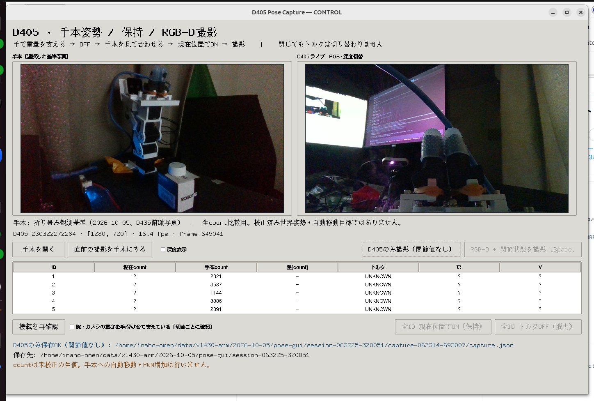

# D405 手本姿勢・保持・撮影GUI



手本の写真とD405ライブ映像を並べ、5台の現在count・手本との差・トルク・温度・電圧を表示する。手で合わせた姿勢を現在位置で保持し、RGB-Dと関節状態を記録するためのネイティブGUI。世界角への校正や手本への自動移動は行わない。
「D435 + 関節状態を撮影」（F9）で俯瞰側のRGB-D/params/前後関節値も保存できる。D405はF8。Q/q/Escはトルク状態を変えずGUIを終了する。

## 起動

このリポジトリ内で実行する。このPCのX11 displayは`:1`。別PCでは実際のDISPLAYを指定する。

```bash
rtk proxy env DISPLAY=:1 uv run --no-sync python -m arm_observer.pose_gui --control
```

`--control`無しはREAD-onlyで、トルクボタンが無効。起動と終了はトルク状態を変更しない。Tkinter（Ubuntu `python3-tk`）とPillowを使用する。OpenCV headlessを入れ替えたり、cvui/OpenCV GUI版を重複インストールしたりする必要はない。

既存D405 owner `http://127.0.0.1:18109`（serial `230322272284`）を利用する。カメラSDKをこのプロセスから開かない。別のowner/個体では `--camera URL --serial SERIAL` を指定。serial接続先は `config/arm.toml`、上書きは `--device PATH`。対象はXL430-W250・ID1..5・1Mbps・Protocol2・mode3。
俯瞰D435はowner `http://127.0.0.1:18108`、serial `922612070196`。別環境では `--d435-camera URL --d435-serial SERIAL` を指定する。D435撮影はD405のlive状態に依存せず、選んだownerのserial/freshnessを撮影時に検証する。

## 操作

1. 左の「手本」を確認する。初期手本は2026-10-05の折り畳み観測基準で、D435俯瞰画像。countは `[2021,3537,1144,3386,2091]`。安全姿勢の認定ではなく記録済みの基準写真。
2. 腕とD405/グリッパの重量を手や受け台で支え、確認チェックを入れて「全ID トルクOFF」。読取りでOFFが確認された後、手で姿勢を合わせる。チェックは切替ごとに解除される。
3. 重量を支えたまま停止させ、再度チェックして「全ID 現在位置でON」。保存した手本countや古いGoal Positionへ移動せず、その台の直前の現在countをparkして保持する。既にONの台の支持目標は触らない。
4. 2〜3秒落ち着かせて「RGB-D + 関節状態を撮影」（F8も可）。前後の全5台count/torque/velocityを撮影と一緒に保存する。SpaceはフォーカスしたGUIボタンの通常操作に使われるため撮影ショートカットにしない。
5. 静止して異常のない撮影を「直前の撮影を手本にする」で次の基準にできる。「手本を開く」は `reference.json` / `capture.json` を選択する。

ON準備では全台のID/model/secondary alias/mode/drive/homing/position limit/healthを確認する。OFFの台のみGoalPWMを現在値と350（ID5は310）の小さい方へ下げ、Profile Acceleration=1、Velocity=6のRAM設定で保持する。既に低いPWMは増やさない。OFF/終了時も高いPWMへ自動復帰しない。EEPROM/ID/gain/mode変更は許さない。

停止した3標本のspan<=3count/速度0、park readback、ON後15count超のjumpを確認。部分失敗では異常を表示して以後の切替をロックし、自動OFF/盲目的な再試行を行わない。「接続を再確認」は明示的にserialを開き直してID/mode/状態を再検査する。別のmonitor/Wizard/制御プロセスがserialを使用中なら起動を拒否する。

## 保存

標準出力先は `~/data/xl430-arm/YYYY-MM-DD/pose-gui/session-HHMMSS-*/`。別の場所は `--output PATH`（新しいディレクトリ）で指定。

- `capture-*/`: color PNG、raw/aligned uint16 depth、IR左右、depth preview、metadata.json、calibration.toml、capture.json。
- D435出力は `capture-d435-*/`。capture.jsonの `camera_name` とmetadataのserialで撮影個体を区別する。
- `capture.json`: 撮影前後の生関節値、torque/velocity/health、camera receipt、host-time bracket、accepted/rejected。ハードウェア同期ではない。
- `reference/`: 選んだ手本の画像実体とJSON。source pathだけを保存しない。
- `events.jsonl`: READ、各RAM送信、操作結果、異常、serial close。`session.json`: 接続先と起動モード。

カメラのみ使う場合は、別ボタン「D405のみ撮影（関節値なし）」を押す。この場合 `camera_only=true`、`counts=null`、`accepted=false`。自動でこのモードへ切り替えたり、正解関節姿勢として登録したりしない。

## 今回の確認結果（2026-10-05）

xdotoolで実GUIのD405撮影・RGB/深度切替・関節値不明の手本登録拒否・終了を操作した。D405実データは1280x720、depth uint16、scale約0.0001m/count。GUIで撮影した実体は `diary/2026-10-05/d405-pose-gui/rgbd-evidence/`にも保存。

実機は06:25のREAD検査で全5台がNo PING response。電源/通信原因と現在のtorque状態は未確定。**実機ON/OFFは実施していない。** GUIはUNKNOWNを表示して関節付き撮影と切替を無効化している。電源・USBを確認した後「接続を再確認」を使う。

ON/OFFの実SDK通信境界、current-count park、既ON不変、初期RAM profileからの低速/PWM制限、alias拒否、撮影の前後bracket/動作拒否/古いframe拒否は `tests/test_pose_gui.py` の4件がPASS。変更箇所ruff/ty PASS。実機WRITEは0件、終了時port closeを確認した。

[HTML証跡](../diary/2026-10-05/d405-pose-gui/REPORT.html)、[作業書](../diary/2026-10-05/d405-pose-gui/WORKDOC.md)。以前のキャップ把持DoDは未達のまま。

## 実装構成・根拠

`pose_gui.py` はTkメインスレッドの描画と、一つのserial worker・独立したcamera preview workerを持つ。`pose_gui_control.py` は送信を一取引ごとのexact tokenで検査する。SDK読取り、identity/health、排他的serial open/closeは既存実装を再利用する。

Tkのイベントループ内でI/Oを待たない設計は[Python公式のTkinter threading model](https://docs.python.org/3/library/tkinter.html#threading-model)に基づく。画面操作は[xdotool公式ドキュメント](https://github.com/jordansissel/xdotool/blob/main/xdotool.pod)のmouse/window操作を使用した。
