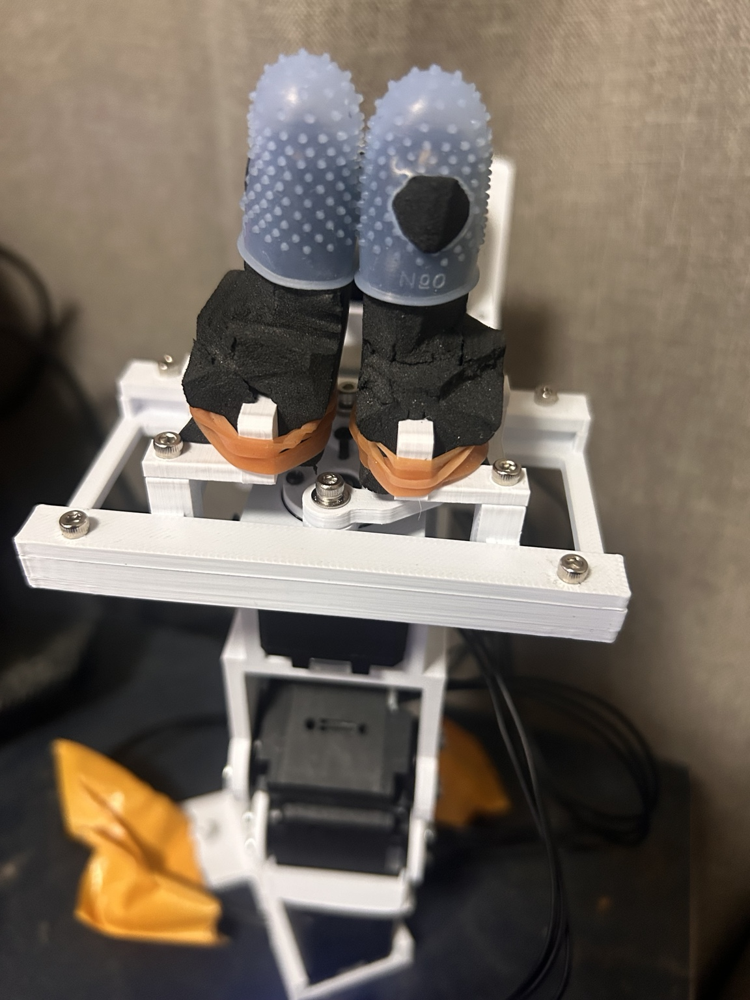
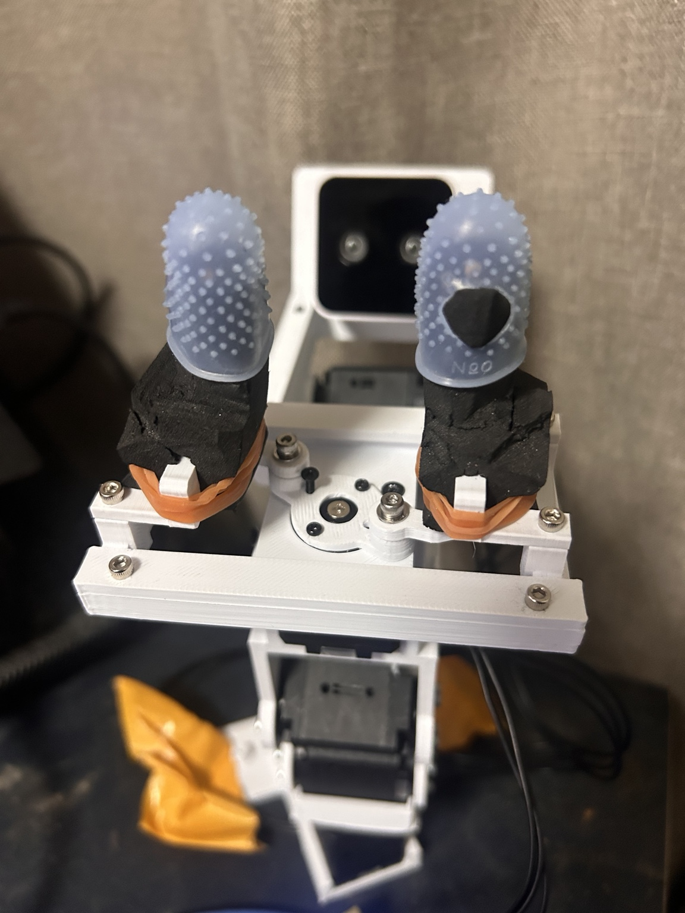

# 現物グリッパとID5の制約（2026-10-04）

実機の開→閉をD435/D405双方で確認し、RGB・Z16深度・IR・K・歪み・scale・実時刻を保存した。
[写真付きHTML](../diary/2026-10-04/gripper-mounted-review/REPORT.html)と
[作業書](../diary/2026-10-04/workdocs/workdoc_Oct04-2026_gripper_open_close.md)が実行証拠。

## 現物・入力の版

アームはlow_cost_robot all-xl430-arm由来R3系、PG3の旧C7爪が有力、長尺D405 R5系65°が第一候補。
爪の厳密版とカメラ65°/75°は未確定。softtipが爪を覆うため新写真からC9と断定しない。
[元仕様](CURRENT_ARM_SPEC.md)の既存provenanceも参照。

提供scanfit ZIP SHA256：`76d72f6a7af0d9bfab11a3c1ad6e02c246b6aeb5d0d0eff5a7f4f0761a8d7238`。
CRC正常、MANIFEST96件一致。frame/capはgripper側PG3_C92_J28 donorとhash一致。
softtip外形6部品だけで、運動機構・中空・弾性・把持力を含まない。
STEP/STL mm Zup、GLB m Yup、変換`(x,y,z)GLB=(x,z,-y)CAD/1000`。
独立STEP再importは6件すべてvalid/1solid/正volume、STLも6件finite/watertight/正volume。
cot p95約0.91/0.96mm、foam約1.95/2.79mm、右foam最大約4.38mm。
4点ねじXY残差0.12mmは同じfit点への残差で独立精度ではない。

## 開閉の方向と位相

写真は前者が指サック接触、後者が大きな間隔。画面は181.41°/239.50°だがIDは画角外。
初稿は掲載順から対応を推定した。ユーザーが「181.41°が閉、239.50°が開」と明示回答し、
この対応を根拠に正count＝開とした。fresh ID5閉READ2067（181.67°）も対応する。
今回の二眼小開・中開・観測最大開で実際の隙間増加を確認した。
取付写真だけでは出力ホーンとクランクの位相を確定できない。

ID5はjaw駆動でwrist rollではない。PG3 CAD角25..135°はservo角ではない。
CAD sliderは`x=r*cos(theta)+sqrt(L^2-(r*sin(theta))^2)`（r14/L24mm）。
servo→CADの取付offsetは未校正。開口幅は角度に比例しない。

## 実測と採用範囲

|状態|実測count|閉基準2067からの角度|判定|
|---|---:|---:|---|
|初期閉|2067|0°|二眼で接触|
|小開|2173|約9.32°|二眼で隙間|
|中開|2281|約18.81°|二眼で隙間、20°指令から14count残差|
|観測最大開|2486|約36.83°|二眼で開、40°指令の厳密到達は失敗|
|再閉|2091|約2.11°|二眼で指サック接触、元countへの厳密復帰ではない|

写真の手動開239.50°≒2725countは機械限界でも全域の安全保証でもない。
今後の初期ソフト制限候補は**2091..2486count（183.78..218.50°）**。
これは今回実画像で観測した両端の間を使う候補で、任意荷重の全域承認ではない。
開口幅・圧縮量・ケーブルの姿勢依存・全腕自己干渉は未校正。
実行envelope2067..2668は仮の外側guardで、2668まで実機承認した意味はない。
EEPROM Min/Max Position Limitは0..4095のまま変更していない。

## 制御と終了

新しい`gripper_motion`だけがID5 RAM64/100/108/112/116をWRITE。旧observer/ID3窓は変更なし。
model1060、ID5 firmware43、mode3、drive0、homing0、all IDs1..5 primary/secondary255をfresh READ。
PV3/PA1、PWM上限310（写真の35.03%）、温度55℃未満、電圧8..14V、errorなし。
他軸torque OFFかつ開始から15count以内、ID5窓外・torque低下・不完全READで停止。
18秒期限、遠方>25countで1.5秒4count未満の停滞はOFF。近傍<=25は10静止sample/span2を要求し、
12count超の目標残差をsettled_off_targetと記録する。保持は受理した実測位置から12count以内。
力や目標を追加して押し切る補正なし。閉指令は元の観測2067より下へ出していない。

初期PWM150/250は初動で飽和・停止。310で開を確認したが、摩擦の原因は未特定。
40°指令は実測2487で35count残り・PWM175/load197の静止となり、出力飽和ではない。
エラーを消すため40°条件を緩めていない。開いた観測状態を再READして独立に閉試験を実行。
最終全台OFF、ID5 PWM885/PA0/PV0の復元READ一致、port閉。電源装置のOUTPUTはPCから操作しない。

[ROBOTIS XL430公式](https://emanual.robotis.com/docs/en/dxl/x/xl430-w250/)では
位置mode3のEEPROM limitはaddr48/52、4096count/rev、Goal PWM100は出力上限。
Present Load126は内部推定で力センサーではない。XL430にcurrent-based position modeはない。

## カメラとデータ

D435 serial922612070196、D405 serial230322272284。RGB/depth/IR1280×720、設定30fps。
両眼所有プロセス同時使用の実取得は約17–19Hz。連写と停止画像はhost時刻で対応づけ、hardware同期ではない。
D435 scale約0.001m/count、D405約0.0001m/count。
D405 RGB inverse Brown歪み係数は非ゼロのまま保存。depth/colorを同じKと扱わない。
暗所D435ノイズ、逆光D405黒部品、近接深度欠損を記録。黒depthを補完していない。
ROIは矩形で背景混在、nonzero率は正確なsofttip距離精度の証明ではない。

原データ：`~/data/xl430-arm/2026-10-04/gripper-open-close/`。
日誌に同じ実体とhash manifest、2回の初期停止・off-target停止を保存。
現在のarm perception NPZには爪がないので、この実機グリッパの開閉認識モデルとして未検証。
