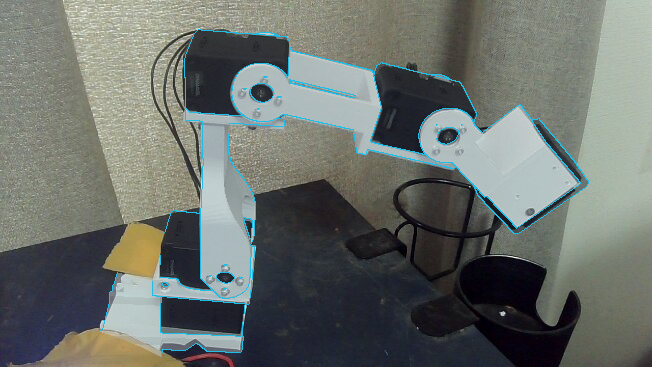

# D405装着前のXL430アーム：尺度付き関節位置合わせの実行報告

作成：2026-10-04T19:38:41+09:00  
対象：2026年10月4日17:30頃までの作業状態として提供された、652×367画素の写真と単眼推定深度。

## 1. 判定

**画像整合の暫定基準は達成しました。ただし、依頼全体のDoDは未完了です。D3のnanobind拡張の実ビルド・読込み・テストが通信／依存不足で停止しています。** 数値本計算は、同じC++共通核を明示C ABI（ctypes）で呼び出して実施しました。nanobindで実行したと読み替えることはできません。

最良候補は注釈改訂2の32試行中の **#01** です。ここでの「最良」は固定した評価式による比較結果であり、全域最適性や実際の関節角の正しさを保証しません。手動特徴点・輪郭の補助を使った関節付きFilterReg拡張です。

[元画像・CAD重畳・CAD単独の比較](comparison.png) ／ [遮蔽注釈なしの全形状重畳](raw_geometry_overlay.png) ／ [領域の差分図](silhouette_error.png) ／ [未使用検証点](held_out_landmarks.png)

## 2. 評価値

|評価対象|結果|解釈|
|---|---:|---|
|完了した初期値|32 / 32|同一のseed体系と評価式で比較|
|可視領域IoU|0.906979|手動領域と予測可視面の交差／和集合|
|訓練特徴点5点：再投影RMSE|0.9193 px|初期化・画像補助・選定に使用|
|未使用特徴点14点：誤差中央値|3.7183 px|初期化・最適化・候補選定には不使用|
|未使用特徴点14点：RMSE|3.3644 px|同一画像の手動注釈に対する値|
|未使用特徴点14点：最大誤差|4.9897 px|P04下側のねじ中心|
|双方向点群RMSE、全点|0.01936594 深度単位|両方向の平均二乗残差を等重みで平均|
|双方向点群RMSE、各方向の小さい90%|0.00458445 深度単位|各方向を90%残し、残した点をプールして計算|
|同90%残差のCAD尺度換算|2.7195 mm|条件付きの再構成残差。実測精度ではない|
|重複画素の深度絶対残差中央値|0.00576866 深度単位|CAD奥行きと単眼推定深度の差|
|重複画素の深度RMSE|0.03168091 深度単位|境界・単眼推定歪みを含む|
|固定した選定式の値|0.157227338|小さいほど良い|

作業書の暫定基準 **IoU≧0.70、未使用点の誤差中央値≦8px** を満たしました。IoUの交差は48,722画素、和集合は53,719画素です。90%残差と全点残差は集約の重みが異なるため、単純に同じ母集団の指標として差を解釈しないでください。すべての生の評価値は `metrics.json` にあります。

14点は別の実測データセットではなく、同一写真で今回手動注釈した点です。位置決めの不確かさを約2画素と扱っています。これらの点の値は採用候補を決めた後で計算しましたが、注釈者が同じ画像を見ていることによる系統誤差や依存性は残ります。

## 3. 尺度・姿勢・関節

変換の定義は `p_depth = s × R × FK(q)_meters + t_depth` です。CADの寸法を一様に変更して実物を変形したのではなく、任意尺度の単眼点群へCADを対応させる相似変換を推定しています。

- **s = 1.685741593683 深度単位 / m**
- **1深度単位 = 0.593210729181 m**（CAD寸法・投影モデルに依存する換算）
- 並進 `t_depth = [-0.106028395, 0.147194903, 0.693520506]`
- CAD尺度で換算した並進 `t_depth / s = [-0.062897182, 0.087317596, 0.411403805] m`

|関節|R3保存姿勢からの推定角|備考|
|---|---:|---|
|J1|-3.497309°|派生URDFの定義|
|J2|-3.123300°|派生URDFの定義|
|J3|-9.716439°|派生URDFの定義|
|J4|-32.436777°|派生URDFの定義|
|J5|推定しない（null）|下流の装着物がない今回のモデルでは可視形状を動かせない|
|J6|モデルに含めない|6個目のモーターは未装着として除外|

回転行列と各リンクの4×4変換は `transforms.json`、初期値と最終値は `best.json` にあります。角度は実機のゼロ点・回転方向・機械的限界を校正していません。探索範囲の±πは数値上の境界であり、実機の可動保証ではありません。これらをそのままモーターへ送る指令値としないでください。

## 4. 原資料・部品構成・座標

選定した原資料は、添付 `3d-printed-dynamixel-gripper-main/references/arm-r3/arm_XL430_R3.step` です。R3のジョイント情報と末端要素一覧で版を照合しました。別添の旧URDFは親子構造の比較に使用し、異なる版の寸法を混用していません。裸アーム用のR3 URDFを別途書き出し、独立にXMLを読んだ親子FKと保存STEP座標のFKを非ゼロ関節姿勢で照合しました。

原STEPの217末端要素から、**5モーター×35要素＋プリント部品P01〜P05＝180要素**を選択しました。D405と取付物、爪、6個目のモーターは含めていません。離散化したモデルは193,699頂点、192,151三角形です。CADのmmをmへ一度だけ換算し、既に組み立て済みのSTEP保存姿勢へゼロ姿勢回転を二重適用していません。各要素の境界を付属一覧と照合しました。

主試行の投影は、指定の **水平51.0°、垂直30.0°** です。焦点距離はfx=683.4732133、fy=684.8313232、主点は(cx,cy)=(325.5,183)です。一方、添付points.exrから逆算した元の画角は **50.245516°×29.571627°**、fx≃fy≃695.2165でした。そのため主試行は指定画角で `depth.exr` を再投影しており、異なる投影条件のxyzを無説明で混ぜていません。

EXRのzとdepthは数値差0、元PLYの符号をdiag(1,−1,−1)で変換したサンプルの最近傍差も0でした。画像系はx右/y下/z前、元MoGEのPLYとGLBはx右/y上/z後です。出力 `fitted_cad_camera.ply` は前者、`fitted_cad_opengl.ply` と `fitted_cad_opengl.glb` は後者です。いずれも任意深度単位であり、GLBの慣例だけを根拠にm単位と解釈しないでください。

## 5. FilterRegの実装と画像補助

一次資料はGao・TedrakeのFilterReg原論文（CVPR 2019、arXiv:1811.10136）です。E段階では固定した観測Gaussianから質量・一次モーメントを求め、M段階では各リンクのtwist正規方程式を集約して関節空間へ写します。元の関節用C++と式・符号を照合しています。詳細は `../docs/method.md` に記載しました。

点対点版を基礎に、6自由度の全体姿勢、一様尺度、可観測4関節の計11変数を推定します。尺度は正を保つlog表現で、リンクごとの集約を7×7のsimilarityブロックへ拡張しています。Gaussianの近似には添付CPD改良版由来のno-blur格子を用い、厳密Gaussian総和も独立した試験経路として備えています。単一最近傍ICPに置き換えてFilterRegと呼んだものではありません。

主条件はGaussian幅0.035／0.023／0.015／0.010／0.007、各14反復、外れ値係数0.1です。訓練点5点と輪郭の画像項を明示的に追加しています。CAD自体の奥行き判定で可視面を選び、凍結したE段階の対応に対して減少を確認する線探索を用います。反復間で可視面を更新するため、固定サンプルの元のEM尤度が全反復で単調減少するとまでは主張しません。

初期姿勢から回転・並進・log尺度・関節角を乱数種20261004で散らした32候補を比較しました。通常の散布幅は回転5°、並進0.009深度単位、log尺度0.07、関節8°で、一部候補では1.8倍です。無条件の広域探索ではなく、画像由来初期姿勢の周りの多初期値探索です。選定式は `(1−IoU)+0.12×(90%点群RMSE/0.01)+0.03×(訓練点RMSE/3)` です。

EdgeTAM／SAM／BiRefNetの学習済み重みと、ユーザーのBiRefNet出力マスクは添付されていません。今回は**手動注釈**であり、ニューラルモデルの推論結果とは称していません。ID1を含めて領域を指定し、ケーブルを対象外とし、布・テープの前景遮蔽を別に保存しました。予測CADをロボ領域マスクで切り抜いて不一致を隠してはいません。遮蔽なしの全形状重畳も提供しています。

注釈改訂1の32試行後、差分図からP04下縁の凹角を一つ落として背景三角形を含めていたことを検出しました。元RGBの実際の角(363,134)を追加し、改訂1一式を `archive_annotation_v1/` に保存しました。未使用検証点・閾値・係数は変えず、改訂2で32試行を再実行しました。この修正は最初の試行前の盲検作業ではありません。

## 6. 感度・縮退・未確定性

EXR固有の投影条件を用いた別の1初期値試験では、尺度は **1.659657832**、IoUは **0.906497** でした。主結果との尺度差は約1.55%です。カメラ校正のわずかな差が尺度に影響する実例であり、主32試行の順位には混ぜていません。

**画像補助を全て外し、尺度を自由にしたGaussianデータ項だけの別試験は縮退しました。** 同じ訓練点由来の初期化から開始しても、尺度は0.578132、IoUは0.153992まで悪化しました。したがって今回の成功は画像補助付き拡張の成功であって、無補助の自由尺度FilterRegの成功ではありません。元論文の固定尺度アルゴリズム一般が失敗するという結論でもありません。

32試行の尺度範囲は1.685228215〜1.685921778でしたが、同じデータ・同じ注釈・同じ投影モデルでの初期値間の広がりにすぎず、統計的信頼区間ではありません。単眼深度の非一様歪み、遮蔽、手動注釈、現物加工とCADの差は残ります。P05の穴は写真と元CADで大きさに差があり、CAD形状を画像へ合わせて改変せず中心位置で評価しました。

格子近似と厳密Gaussianの合成比較では、σ=0.012、700観測・150問合せの重心差中央値0.001810856、95百分位0.004312829深度単位でした。格子近似が厳密値と一致するとの保証はありません。

## 7. 実装検証・再現・DoD

明示C ABI経路で、Gaussian厳密対照、格子局所平均、異常入力／解放後アクセス、リンク集約対照、有限差分Jacobian、合成姿勢・尺度・関節回復、独立URDF FK、透視補正Z-buffer、32試行記録契約、整数添字の桁あふれ拒否を試験し、**14テストが合格**しました。整数の桁あふれは追加REDテストで失敗を確認してから、int32へ狭める前の範囲検査を追加しました。

選択試行#01の保存初期値から再実行し、**全状態パラメータの最大差0、選定スコア差0**を確認しました。これは今回の同一環境での再現結果で、別OS／BLAS／コンパイラでもビット一致するとの約束ではありません。構文、末尾空白、PNG寸法、元13ファイルのSHA256不変も確認しました。Ruff／Black／静的型検査は実行しておらず、それらに合格したとは記載していません。

|DoD|判定|主な証跡|
|---|---|---|
|D1 元CAD／URDF／入力座標|達成|`../docs/input_audit.json`, `../model/`|
|D2 関節付きGaussian E/Mと数値試験|達成（明示C ABI）|`../cpp/`, `../tests/`, `../logs/tests_release.txt`|
|D3 nanobindをuv経由で実ビルド・import・試験|**未達**|`../logs/nanobind_configure.txt`, `../logs/uv_lock_offline.txt`|
|D4 注釈由来・24以上の初期値・尺度比較|達成|`../annotations/`, `trials/`, `all_trials.csv`|
|D5 CAD重畳・共通評価・基準判定|達成|`overlay.png`, `metrics.json`, `best.json`|
|D6 再現手順・品質・記録・最終レビュー・梱包|達成|作業書、`../docs/final_review.md`, `../docs/package_validation.json`|

nanobind 2.12.0とscikit-build-coreを指定した `pyproject.toml`、CMake、`cpp/bindings.cpp` は作成しましたが、`No module named nanobind` によりその経路の構成が失敗しています。fresh uv lockも依存キャッシュ不足で失敗し、偽の成功済みlockは作っていません。依存を取得できる環境で標準経路のビルド・試験を実行することがD3の残作業です。C ABI経路は明示選択時だけ動作し、暗黙の代替ではありません。

再実行コマンド、構成、依存版、入出力は `../README.md`、`../requirements-tested.txt`、`../docs/environment.json` にあります。実機通信・駆動、元CADの上書き、Gitへの書込みは行っていません。

## 8. 配布物の確認

予備ZIPを別ディレクトリへ展開し、CRCと全ファイルのSHA256・サイズを照合しました。展開したソースからC ABI数値核を新規ビルドして14テスト合格、選択試行の再現差0を確認しました。再描画した7種類の画像、metrics.json、transforms.jsonは元出力とバイト一致しました。旧Eigen由来のC++非推奨警告はビルドログへ保存しており、警告ゼロのビルドとは記載しません。

`../docs/package_validation.json` はその再ビルド・再現検査、`../docs/package_manifest.json` は配布内容のSHA256一覧です。最終ZIP自身のCRC・全項目ハッシュ照合とZIPハッシュは、ZIP外の `robot_fit_20261004.validation.json` にあります。元ZIP群・仮想環境・コンパイル済みライブラリ・フォントは配布ZIPに含めません。D3が未達であることは、梱包検査が成功しても変わりません。
